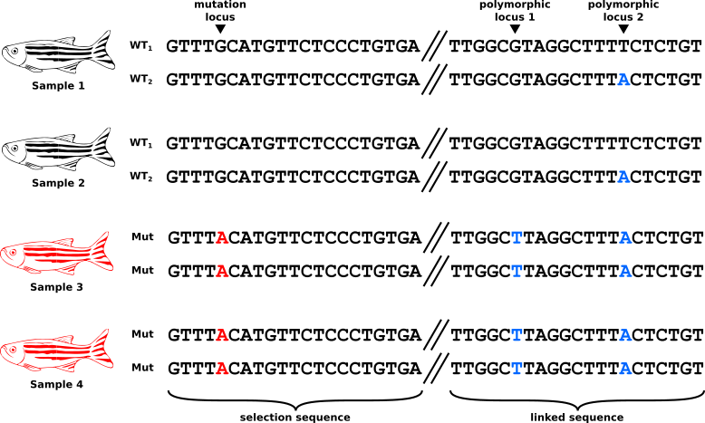
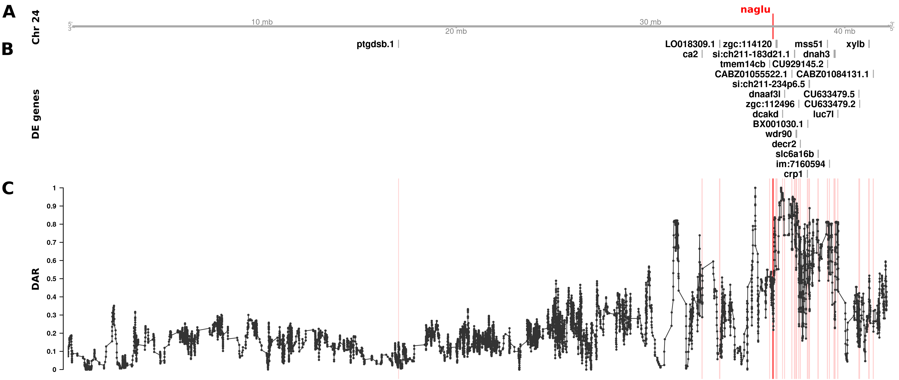

```{r setup, include = FALSE}
knitr::opts_chunk$set(
  echo = TRUE,
  message = FALSE,
  warning = FALSE,
  error = FALSE
)
knitr::opts_knit$set(root.dir = rprojroot::find_rstudio_root_file())
```

```{r pkgs}
library(tidyverse)
library(GenomicRanges)
library(edgeR)
library(scales)
library(extraChIPs)
library(here)
library(tadar)
library(kableExtra)
library(magrittr)
library(pander)
library(viridis)
library(reactable)
library(ggpubr)
theme_set(theme_bw())
```

```{r lb_reactable}
lb_reactable <- function(
        tbl, highlight = TRUE, striped = TRUE, compact = TRUE,
        wrap = FALSE, resizable = TRUE, searchable = TRUE,
        style = list(fontFamily = "Calibri, sans-serif"), ...
){
    reactable(
        tbl,
        highlight = highlight, striped = striped, compact = compact,
        wrap = wrap, resizable = TRUE, searchable = TRUE,
        style = style, ...
    )
}
tooltip <- function(value, tooltip) {
    tags$abbr(
        style = "text-decoration: underline; text-decoration-style: solid; cursor: help",
        title = tooltip,
        value
    )
}
react_format <- function(format, digits = 2){
    function(val, ind, col_name){
        formatC(val, digits = digits, format = format)
    }
}
```

# Introduction

## What is DAR?

- **D**ifferential **A**llelic **R**epresentation
- DAR describes an unequal distribution of polymorphic loci between two experimental sample groups (e.g. Mutant vs WT)



- It's extent is quantified by the DAR metric, which represents the difference in genetic sequence at a locus
+ A DAR metric is calculated at all suitable loci along the genome 
+ A value between 0 and 1 inclusive, where 0 represent complete identity and 1 represents complete diversity



## How does DAR affect RNA-seq analysis?

- When a locus with high DAR is also an eQTL, a gene's expression level is observed as different between the experimental groups
+ This results in the gene being classified as differentially expressed
- However, the differential expression is in fact an artefact of DAR, and not due to the experimental condition being tested

# Strategy

## The Beta distribution

- Normally, under the null hypothesis *p*-values follow a uniform distribution
- The uniform distribution is a special case beta distribution
+ The beta distribution's shape is controlled by the beta function:

$$B(\alpha,\beta)=\int_{0}^{1}t^{\alpha-1}(1-t)^{\beta-1}dt$$

- When we set $\alpha$ (shape1) and $\beta$ (shape2) equal to 1, we see the uniform distribution:

```{r}
rbeta(10e4, shape1 = 1, shape2 = 1) %>%
  as_tibble() %>%
  ggplot(aes(value)) +
  geom_histogram(
    colour = "black", fill = "grey50", bins = 50, boundary = 0
  ) +
  labs(x = "p")
```

- Changing $\alpha$ and $\beta$ to different values skews the distribution:

```{r}
tibble(
  `alpha = 0.5` = rbeta(10e4, shape1 = 0.5, shape2 = 1),
  `alpha = 0.8` = rbeta(10e4, shape1 = 0.8, shape2 = 1),
  `beta = 0.5` = rbeta(10e4, shape1 = 1, shape2 = 0.5),
  `beta = 0.8` = rbeta(10e4, shape1 = 1, shape2 = 0.8)
) %>%
  pivot_longer(cols = everything()) %>%
  ggplot(aes(value)) +
  geom_histogram(
    colour = "black", fill = "grey50", bins = 50, boundary = 0
  ) +
  labs(x = "p") +
  facet_wrap(~name, nrow = 2)
```

## How can we use the DAR metric to improve our interpretations?

- We propose that in the presence of DAR, the *p*-value distribution under the null hypothesis is right-skewed
+ Similarly to setting $\alpha$ to a value less than 1
- If we can estimate the value of $\alpha$ at any DAR value, we can use beta probability distribution function to correct our *p*-values from differential expression testing of genes in regions of high DAR.

# Dataset A (zebrafish)

- [GEO](https://www.ncbi.nlm.nih.gov/geo/query/acc.cgi?acc=GSE217196)
- [Github repository](https://github.com/baerlachlan/211130_Q96K97del_A603fs)

## Sample structure

- Q96K97del/+ ($n = 8$, *psen1* gene, Alzheimer's disease model)
- A603fs/+ ($n = 8$, *naglu* gene, MPS IIIB model)
- WT ($n = 8$)

## Load data

```{r}
dar_A <- read_rds(here("data/dar/dar_fixed_A.Rds")) %>%
  sortSeqlevels() %>%
  endoapply(sort)
gene_dar_A <- read_rds("data/dar/gene_dar_fixed_A.Rds") %>%
  sortSeqlevels() %>%
  endoapply(sort)
dge_A <- read_rds("data/de/dgeList_psen1_naglu.Rds")
dge_A$samples <- dge_A$samples %>%
  mutate(
    group = case_when(
      genotype == "EOfAD-like" ~ "eofad",
      genotype == "MPS-IIIB" ~ "mps",
      genotype == "WT" ~ "wt",
    ),
    group = factor(group, levels = c("wt", "eofad", "mps"))
  )
dge_A <- DGEList(
  counts = dge_A$counts,
  samples = dge_A$samples,
  genes = dge_A$genes,
)
dge_A <- dge_A %>%
  estimateDisp(design = model.matrix(~0 + group, .$samples))
colnames(dge_A$design) <- str_remove_all(colnames(dge_A$design), "^group")
```

```{r}
contrasts_A <- makeContrasts(
  eofad = eofad - wt,
  mps = mps - wt,
  levels = unique(dge_A$samples$group)
)
```

```{r}
## Rerun the analysis using glmQL-Fits
res_A <- lapply(colnames(contrasts_A), function(x){
  dge_A %>%
    glmQLFit() %>%
    glmQLFTest(contrast = contrasts_A[,x]) %>%
    # glmQLFTest(coef = "groupmps") %>%
    topTags(n = Inf) %>%
    .[["table"]] %>%
    makeGRangesFromDataFrame(keep.extra.columns = TRUE) %>%
    sortSeqlevels() %>%
    sort()
}) %>%
  set_names(colnames(contrasts_A))
```

## Exploration

```{r, results='hide'}
lapply(names(res_A), function(x){
  res_A[[x]] %>%
    mcols() %>%
    as_tibble() %>%
    dplyr::select(
      starts_with("gene"), starts_with("log"), PValue, FDR
    ) %>%
    left_join(
      mcols(gene_dar_A[[x]]) %>% as_tibble() %>% dplyr::select(gene_id, dar)
    ) %>%
    ggplot(aes(dar, -log10(PValue))) +
    geom_point() +
    labs(title = x)
})
```

```{r, results='hide'}
lapply(names(res_A), function(x){
  res_A[[x]] %>%
    mcols() %>%
    as_tibble() %>%
    dplyr::select(
      starts_with("gene"), starts_with("log"), PValue, FDR
    ) %>%
    left_join(
      mcols(gene_dar_A[[x]]) %>% as_tibble() %>% dplyr::select(gene_id, dar)
    ) %>%
    mutate(
      dar_q = cut(
        dar,
        breaks = quantile(dar, probs = seq(0, 1, length.out = 21), na.rm = TRUE),
        # breaks = seq(0, 1, length.out = 7),
        include.lowest = TRUE
      ) %>%
        fct_na_value_to_level(levels(.)[[1]])
    ) %>%
    ggplot(aes(PValue, after_stat(density))) +
    geom_histogram(fill = "grey70", colour = "black", binwidth = 0.01) +
    geom_line(
      ## Add 1 - dar^2 in red
      aes(y = y, colour = f),
      data = . %>%
        pull(dar_q) %>%
        levels() %>%
        sapply(
          \(x) {
            min_dar = str_replace_all(x, "^[^0-9]([0-9\\.]+),.+", "\\1") %>% as.numeric()
            tibble(
              PValue = seq(0.01, 1, by = 0.01),
              `1 - DAR` = dbeta(PValue, 1 - min_dar, 1),
              `1 - DAR^2` = dbeta(PValue, 1 - min_dar^2, 1),
              `sqrt(1 - DAR)` = dbeta(PValue, sqrt(1 - min_dar), 1),
            )
          },
          simplify = FALSE
        ) %>%
        bind_rows(.id = "dar_q") %>%
        pivot_longer(
          cols = contains("- DAR"), names_to = "f", values_to = "y"
        ) %>%
        mutate(dar_q = fct_inorder(dar_q)),
    ) +
    geom_label(
      aes(x = 1, y = 0, label = label),
      data = . %>%
        summarise(n = dplyr::n(), .by = dar_q) %>%
        mutate(label = paste("n =", comma(n))),
      hjust = 1, vjust = 0, alpha = 0.7
    ) +
    facet_wrap(~dar_q, scales = "free_y") +
    labs(title = x)
})
```

```{r}
beta_fits_A <- sapply(names(res_A), simplify = FALSE, function(x){
  res_A[[x]] %>%
    as_tibble() %>%
    dplyr::select(
      range, starts_with("gene"), starts_with("log"), PValue, FDR
    ) %>%
    left_join(
      mcols(gene_dar_A[[x]]) %>% as_tibble() %>% dplyr::select(gene_id, dar)
    ) %>%
    dplyr::filter(!is.na(dar)) %>%
    # mutate(dar_q = cut(dar, seq(0, 1, length.out = 5))) %>%
    mutate(
      dar_q = cut(
        dar,
        unique(quantile(dar, probs = seq(0, 1, length.out = 26))),
        include.lowest = TRUE
      )
    ) %>%
    split(.$dar_q) %>%
    lapply(
      \(x) {
        tryCatch({  # !!
          fit <- MASS::fitdistr(x$PValue, "beta", list(shape1 = 1, shape2 = 1))
          tibble(
            dar = median(x$dar),
            shape1 = fit$estimate["shape1"],
            se1 = fit$sd["shape1"],
            shape2 = fit$estimate["shape2"],
            se2 = fit$sd["shape2"]
          )
        }, error = \(e){
          tibble(
            dar = median(x$dar), shape1 = NA, se1 = NA, shape2 = NA, se2 = NA
          )
        })
      }
    ) %>%
    bind_rows() %>%
    mutate(shape1_norm = shape1 / max(shape1, na.rm = TRUE))
})
```

```{r}
sapply(beta_fits_A, simplify = FALSE, function(x){
  as.data.frame(x)
})
```

### EOfAD

```{r}
plotly::ggplotly({
  plotDarECDF(dar = dar_A$eofad, dar_val = "origin")
})
```

#### Before normalisation of alpha

```{r}
# lm(shape1 ~ dar + I(dar^2), data = beta_fits_A$eofad) %>%
lm(shape1 ~ dar, data = beta_fits_A$eofad) %>%
  step() %>%
  summary()
```

```{r}
lm_A_eofad <- function(dar){
  1.53110 - 2.82662 * dar
}
```

```{r, results='hide'}
beta_fits_A$eofad %>%
  mutate(
    `1 - DAR` = 1  - dar,
    `sqrt(1 - DAR)` = sqrt(1 - dar),
    `(1.1 - DAR)^2` = (1.1 - dar)^2,
    `DAR lm` = lm_A_eofad(dar)
  ) %>%
  pivot_longer(cols = matches("DAR", FALSE), names_to = "f", values_to = "estimate") %>%
  mutate(estimate = ifelse(estimate > 1, 1, estimate)) %>%
  ggplot(aes(dar, shape1)) +
  geom_point(
    data = . %>% distinct(dar, shape1)
  ) +
  geom_line(aes(y = estimate, colour = f))
```

```{r}
darP_A_eofad <- res_A$eofad %>%
  as_tibble() %>%
  dplyr::select(
    range, starts_with("gene"), starts_with("log"), PValue, FDR
  ) %>%
  left_join(
    mcols(gene_dar_A$eofad) %>% as_tibble() %>% dplyr::select(gene_id, dar)
  ) %>%
  mutate(
    dar = ifelse(is.na(dar), 0, dar),
    alpha = lm_A_eofad(dar),
    alpha = ifelse(alpha > 1, 1, alpha),
    alpha = ifelse(alpha < 0.1, 0.1, alpha),
    darP = pbeta(PValue, alpha, 1),
    FDR_darP = p.adjust(darP, "fdr"),
    wasDE = FDR < 0.05,
    isDE = FDR_darP < 0.05
  ) %>%
  dplyr::filter(wasDE | isDE) %>%
  dplyr::arrange(!isDE, darP) %>%
  as.data.frame()
```

- No genes were DE

```{r}
res_A$eofad %>%
  as_tibble() %>%
  dplyr::select(
    range, starts_with("gene"), starts_with("log"), PValue, FDR
  ) %>%
  left_join(
    mcols(gene_dar_A$eofad) %>% as_tibble() %>% dplyr::select(gene_id, dar)
  ) %>%
  mutate(
    dar = ifelse(is.na(dar), 0, dar),
    alpha = lm_A_eofad(dar),
    alpha = ifelse(alpha > 1, 1, alpha),
    alpha = ifelse(alpha < 0.1, 0.1, alpha),
    darP = pbeta(PValue, alpha, 1)
  ) %>%
  pivot_longer(
    cols = all_of(c("PValue", "darP")), names_to = "type", values_to = "p"
  ) %>%
  ggplot(aes(sample = -log(p), colour = type)) +
  stat_qq(distribution = qexp) +
  stat_qq_line(distribution = qexp) +
  facet_wrap(~type) +
  scale_colour_brewer(palette= "Set1")
```

#### After normalisation of alpha

```{r}
# lm(shape1_norm ~ dar + I(dar^2), data = beta_fits_A$eofad) %>%
lm(shape1_norm ~ dar, data = beta_fits_A$eofad) %>%
  step() %>%
  summary()
```

```{r}
lm_A_eofad_norm <- function(dar){
  1.14213 - 2.10852 * dar
}
dar_tmp <- dar_A$eofad
lm_all <- tibble(
  dataset = "A_eofad",
  intercept = 1.14213,
  slope = -2.10852,
  dar_mean = mean(dar_tmp$dar_origin),
  dar_median = median(dar_tmp$dar_origin),
  dar_mean_0 = mean(dar_tmp$dar_origin[dar_tmp$dar_origin != 0]),
  dar_median_0 = median(dar_tmp$dar_origin[dar_tmp$dar_origin != 0])
)
```

```{r, results='hide'}
beta_fits_A$eofad %>%
  mutate(
    `1 - DAR` = 1  - dar,
    `sqrt(1 - DAR)` = sqrt(1 - dar),
    `(1.1 - DAR)^2` = (1.1 - dar)^2,
    `DAR lm` = lm_A_eofad_norm(dar)
  ) %>%
  pivot_longer(cols = matches("DAR", FALSE), names_to = "f", values_to = "estimate") %>%
  mutate(estimate = ifelse(estimate > 1, 1, estimate)) %>%
  ggplot(aes(dar, shape1_norm)) +
  geom_point(
    data = . %>% distinct(dar, shape1_norm)
  ) +
  geom_line(aes(y = estimate, colour = f))
```

```{r}
darP_A_eofad_norm <- res_A$eofad %>%
  as_tibble() %>%
  dplyr::select(
    range, starts_with("gene"), starts_with("log"), PValue, FDR
  ) %>%
  left_join(
    mcols(gene_dar_A$eofad) %>% as_tibble() %>% dplyr::select(gene_id, dar)
  ) %>%
  mutate(
    dar = ifelse(is.na(dar), 0, dar),
    alpha = lm_A_eofad_norm(dar),
    alpha = ifelse(alpha > 1, 1, alpha),
    alpha = ifelse(alpha < 0.1, 0.1, alpha),
    darP = pbeta(PValue, alpha, 1),
    FDR_darP = p.adjust(darP, "fdr"),
    wasDE = FDR < 0.05,
    isDE = FDR_darP < 0.05
  ) %>%
  dplyr::filter(wasDE | isDE) %>%
  dplyr::arrange(!isDE, darP) %>%
  as.data.frame()
```

- No genes were DE

```{r}
res_A$eofad %>%
  as_tibble() %>%
  dplyr::select(
    range, starts_with("gene"), starts_with("log"), PValue, FDR
  ) %>%
  left_join(
    mcols(gene_dar_A$eofad) %>% as_tibble() %>% dplyr::select(gene_id, dar)
  ) %>%
  mutate(
    dar = ifelse(is.na(dar), 0, dar),
    alpha = lm_A_eofad_norm(dar),
    alpha = ifelse(alpha > 1, 1, alpha),
    alpha = ifelse(alpha < 0.1, 0.1, alpha),
    darP = pbeta(PValue, alpha, 1)
  ) %>%
  pivot_longer(
    cols = all_of(c("PValue", "darP")), names_to = "type", values_to = "p"
  ) %>%
  ggplot(aes(sample = -log(p), colour = type)) +
  stat_qq(distribution = qexp) +
  stat_qq_line(distribution = qexp) +
  facet_wrap(~type) +
  scale_colour_brewer(palette= "Set1")
```

### MPS-IIIB

```{r}
plotly::ggplotly({
  plotDarECDF(dar = dar_A$mps, dar_val = "origin")
})
```

#### Before normalisation of alpha

```{r}
# lm(shape1 ~ dar + I(dar^2), data = beta_fits_A$mps) %>%
lm(shape1 ~ dar, data = beta_fits_A$mps) %>%
  step() %>%
  summary()
```

```{r}
lm_A_mps <- function(dar){
  1.12769 - 1.80512 * dar
}
```

```{r, results='hide'}
beta_fits_A$mps %>%
  mutate(
    `1 - DAR` = 1  - dar,
    `sqrt(1 - DAR)` = sqrt(1 - dar),
    `(1.1 - DAR)^2` = (1.1 - dar)^2,
    `DAR lm` = lm_A_mps(dar)
  ) %>%
  pivot_longer(cols = matches("DAR", FALSE), names_to = "f", values_to = "estimate") %>%
  mutate(estimate = ifelse(estimate > 1, 1, estimate)) %>%
  ggplot(aes(dar, shape1)) +
  geom_point(
    data = . %>% distinct(dar, shape1)
  ) +
  geom_line(aes(y = estimate, colour = f))
```

```{r}
darP_A_mps <- res_A$mps %>%
  as_tibble() %>%
  dplyr::select(
    range, starts_with("gene"), starts_with("log"), PValue, FDR
  ) %>%
  left_join(
    mcols(gene_dar_A$mps) %>% as_tibble() %>% dplyr::select(gene_id, dar)
  ) %>%
  mutate(
    dar = ifelse(is.na(dar), 0, dar),
    alpha = lm_A_mps(dar),
    alpha = ifelse(alpha > 1, 1, alpha),
    alpha = ifelse(alpha < 0.1, 0.1, alpha),
    darP = pbeta(PValue, alpha, 1),
    FDR_darP = p.adjust(darP, "fdr"),
    wasDE = FDR < 0.05,
    isDE = FDR_darP < 0.05
  ) %>%
  dplyr::filter(wasDE | isDE) %>%
  dplyr::arrange(!isDE, darP) %>%
  as.data.frame()
```

```{r}
kable(darP_A_mps) %>%
  kable_paper() %>%
  column_spec(
    1:ncol(darP_A_mps),
    background = ifelse(darP_A_mps$isDE, "green4", "red3")
  )
```

```{r}
res_A$mps %>%
  as_tibble() %>%
  dplyr::select(
    range, starts_with("gene"), starts_with("log"), PValue, FDR
  ) %>%
  left_join(
    mcols(gene_dar_A$mps) %>% as_tibble() %>% dplyr::select(gene_id, dar)
  ) %>%
  mutate(
    dar = ifelse(is.na(dar), 0, dar),
    alpha = lm_A_mps(dar),
    alpha = ifelse(alpha > 1, 1, alpha),
    alpha = ifelse(alpha < 0.1, 0.1, alpha),
    darP = pbeta(PValue, alpha, 1)
  ) %>%
  pivot_longer(
    cols = all_of(c("PValue", "darP")), names_to = "type", values_to = "p"
  ) %>%
  ggplot(aes(sample = -log(p), colour = type)) +
  stat_qq(distribution = qexp) +
  stat_qq_line(distribution = qexp) +
  facet_wrap(~type) +
  scale_colour_brewer(palette= "Set1")
```

#### After normalisation of alpha

```{r}
# lm(shape1_norm ~ dar + I(dar^2), data = beta_fits_A$mps) %>%
lm(shape1_norm ~ dar, data = beta_fits_A$mps) %>%
  step() %>%
  summary()
```

```{r}
lm_A_mps_norm <- function(dar){
  1.13861 - 1.82260 * dar
}
dar_tmp <- dar_A$mps
lm_all <- lm_all %>%
  rbind(tibble(
    dataset = "A_mps",
    intercept = 1.13861,
    slope = -1.82260,
    dar_mean = mean(dar_tmp$dar_origin),
    dar_median = median(dar_tmp$dar_origin),
    dar_mean_0 = mean(dar_tmp$dar_origin[dar_tmp$dar_origin != 0]),
    dar_median_0 = median(dar_tmp$dar_origin[dar_tmp$dar_origin != 0])
  ))
```

```{r, results='hide'}
beta_fits_A$mps %>%
  mutate(
    `1 - DAR` = 1  - dar,
    `sqrt(1 - DAR)` = sqrt(1 - dar),
    `(1.1 - DAR)^2` = (1.1 - dar)^2,
    `DAR lm` = lm_A_mps_norm(dar)
  ) %>%
  pivot_longer(cols = matches("DAR", FALSE), names_to = "f", values_to = "estimate") %>%
  mutate(estimate = ifelse(estimate > 1, 1, estimate)) %>%
  ggplot(aes(dar, shape1_norm)) +
  geom_point(
    data = . %>% distinct(dar, shape1_norm)
  ) +
  geom_line(aes(y = estimate, colour = f))
```

```{r}
darP_A_mps_norm <- res_A$mps %>%
  as_tibble() %>%
  dplyr::select(
    range, starts_with("gene"), starts_with("log"), PValue, FDR
  ) %>%
  left_join(
    mcols(gene_dar_A$mps) %>% as_tibble() %>% dplyr::select(gene_id, dar)
  ) %>%
  mutate(
    dar = ifelse(is.na(dar), 0, dar),
    alpha = lm_A_mps_norm(dar),
    alpha = ifelse(alpha > 1, 1, alpha),
    alpha = ifelse(alpha < 0.1, 0.1, alpha),
    darP = pbeta(PValue, alpha, 1),
    FDR_darP = p.adjust(darP, "fdr"),
    wasDE = FDR < 0.05,
    isDE = FDR_darP < 0.05
  ) %>%
  dplyr::filter(wasDE | isDE) %>%
  dplyr::arrange(!isDE, darP) %>%
  as.data.frame()
```

```{r}
kable(darP_A_mps_norm) %>%
  kable_paper() %>%
  column_spec(
    1:ncol(darP_A_mps_norm),
    background = ifelse(darP_A_mps_norm$isDE, "green4", "red3")
  )
```

```{r}
res_A$mps %>%
  as_tibble() %>%
  dplyr::select(
    range, starts_with("gene"), starts_with("log"), PValue, FDR
  ) %>%
  left_join(
    mcols(gene_dar_A$mps) %>% as_tibble() %>% dplyr::select(gene_id, dar)
  ) %>%
  mutate(
    dar = ifelse(is.na(dar), 0, dar),
    alpha = lm_A_mps_norm(dar),
    alpha = ifelse(alpha > 1, 1, alpha),
    alpha = ifelse(alpha < 0.1, 0.1, alpha),
    darP = pbeta(PValue, alpha, 1)
  ) %>%
  pivot_longer(
    cols = all_of(c("PValue", "darP")), names_to = "type", values_to = "p"
  ) %>%
  ggplot(aes(sample = -log(p), colour = type)) +
  stat_qq(distribution = qexp) +
  stat_qq_line(distribution = qexp) +
  facet_wrap(~type) +
  scale_colour_brewer(palette= "Set1")
```

# Dataset B (zebrafish)

- [GEO](https://www.ncbi.nlm.nih.gov/geo/query/acc.cgi?acc=GSE151999)
- [Github repository](https://github.com/baerlachlan/210216_sorl1_snv)

## Sample structure

- V1482Afs/+ ($n = 6$, *sorl1* gene, Alzheimer's disease model)
- R122Pfs/+ ($n = 4$, *sorl1* gene, Alzheimer's disease model)
- V1482Afs/R122Pfs ($n = 6$, *sorl1* gene, transheterozygotes)
- WT ($n = 8$)

## Load data

```{r meta_B}
meta_B <- read_csv(here("data/metadata/sorl1.csv")) %>%
  as.data.frame() %>%
  dplyr::arrange(Run) %>%
  mutate(
    genotype = case_when(
      Genotype == "wild-type" ~ "WT",
      Genotype == "sorl1V1482Afs/+" ~ "V1482Afs_het",
      Genotype == "sorl1R122Pfs/+" ~ "R122Pfs_het",
      Genotype == "sorl1V1482Afs/R122Pfs" ~ "Trans",
    ),
    genotype = factor(
      genotype,
      levels = c("WT", "V1482Afs_het", "R122Pfs_het", "Trans")
    ),
    alias = c(
      paste0(rep("WT", 8), seq(1, 8)),
      paste0(rep("V1482Afs", 6), seq(1, 6)),
      paste0(rep("R122Pfs", 4), seq(1, 4)),
      paste0(rep("Trans", 6), seq(1, 6))
    )
  ) %>%
  dplyr::select(
    sample = Run, genotype, genotype2 = Genotype, alias, gender, tank = Tank
  )
```

```{r}
dar_B <- read_rds(here("data/dar/dar_fixed_B.Rds")) %>%
  sortSeqlevels() %>%
  endoapply(sort)
gene_dar_B <- read_rds("data/dar/gene_dar_fixed_B.Rds") %>%
  sortSeqlevels() %>%
  endoapply(sort)
dge_B <- read_rds("data/de/dgeList_sorl1_cqn.Rds")
dge_B <- DGEList(
  counts = dge_B$counts,
  samples = dge_B$samples,
  genes = dge_B$genes,
  offset = dge_B$offset
)
dge_B <- dge_B %>%
  estimateDisp(design = model.matrix(~0 + genotype, .$sample))
colnames(dge_B$design) <- str_remove_all(colnames(dge_B$design), "^genotype")
```

```{r contrasts_B}
contrasts_B <- makeContrasts(
  V1482Afs = V1482Afs_het - WT,
  R122Pfs = R122Pfs_het - WT,
  trans = Trans - WT,
  levels = unique(dge_B$samples$genotype)
)
```

```{r}
## Rerun the analysis using glmQL-Fits
res_B <- lapply(colnames(contrasts_B), function(x){
  dge_B %>%
    glmQLFit() %>%
    glmQLFTest(contrast = contrasts_B[,x]) %>%
    # glmFit() %>%
    # glmLRT(contrast = contrasts_B[,x]) %>%
    topTags(n = Inf) %>%
    .[["table"]] %>%
    makeGRangesFromDataFrame(keep.extra.columns = TRUE) %>%
    sortSeqlevels() %>%
    sort()
}) %>%
  set_names(colnames(contrasts_B))
```

## Exploration

```{r, results='hide'}
lapply(names(res_B), function(x){
  res_B[[x]] %>%
    mcols() %>%
    as_tibble() %>%
    dplyr::select(
      starts_with("gene"), starts_with("log"), PValue, FDR
    ) %>%
    left_join(
      mcols(gene_dar_B[[x]]) %>% as_tibble() %>% dplyr::select(gene_id, dar)
    ) %>%
    ggplot(aes(dar, -log10(PValue))) +
    geom_point() +
    labs(title = x)
})
```

```{r, results='hide'}
lapply(names(res_B), function(x){
  res_B[[x]] %>%
    mcols() %>%
    as_tibble() %>%
    dplyr::select(
      starts_with("gene"), starts_with("log"), PValue, FDR
    ) %>%
    left_join(
      mcols(gene_dar_B[[x]]) %>% as_tibble() %>% dplyr::select(gene_id, dar)
    ) %>%
    mutate(
      dar_q = cut(
        dar,
        breaks = quantile(dar, probs = seq(0, 1, length.out = 21), na.rm = TRUE),
        # breaks = seq(0, 1, length.out = 7),
        include.lowest = TRUE
      ) %>%
        fct_na_value_to_level(levels(.)[[1]])
    ) %>%
    ggplot(aes(PValue, after_stat(density))) +
    geom_histogram(fill = "grey70", colour = "black", binwidth = 0.01) +
    geom_line(
      ## Add 1 - dar^2 in red
      aes(y = y, colour = f),
      data = . %>%
        pull(dar_q) %>%
        levels() %>%
        sapply(
          \(x) {
            min_dar = str_replace_all(x, "^[^0-9]([0-9\\.]+),.+", "\\1") %>% as.numeric()
            tibble(
              PValue = seq(0.01, 1, by = 0.01),
              `1 - DAR` = dbeta(PValue, 1 - min_dar, 1),
              `1 - DAR^2` = dbeta(PValue, 1 - min_dar^2, 1),
              `sqrt(1 - DAR)` = dbeta(PValue, sqrt(1 - min_dar), 1),
            )
          },
          simplify = FALSE
        ) %>%
        bind_rows(.id = "dar_q") %>%
        pivot_longer(
          cols = contains("- DAR"), names_to = "f", values_to = "y"
        ) %>%
        mutate(dar_q = fct_inorder(dar_q)),
    ) +
    geom_label(
      aes(x = 1, y = 0, label = label),
      data = . %>%
        summarise(n = dplyr::n(), .by = dar_q) %>%
        mutate(label = paste("n =", comma(n))),
      hjust = 1, vjust = 0, alpha = 0.7
    ) +
    facet_wrap(~dar_q, scales = "free_y") +
    labs(title = x)
})
```

```{r}
beta_fits_B <- sapply(names(res_B), simplify = FALSE, function(x){
  res_B[[x]] %>%
    as_tibble() %>%
    dplyr::select(
      range, starts_with("gene"), starts_with("log"), PValue, FDR
    ) %>%
    left_join(
      mcols(gene_dar_B[[x]]) %>% as_tibble() %>% dplyr::select(gene_id, dar)
    ) %>%
    dplyr::filter(!is.na(dar)) %>%
    # mutate(dar_q = cut(dar, seq(0, 1, length.out = 5))) %>%
    mutate(
      dar_q = cut(
        dar,
        unique(quantile(dar, probs = seq(0, 1, length.out = 26))),
        include.lowest = TRUE
      )
    ) %>%
    split(.$dar_q) %>%
    lapply(
      \(x) {
        tryCatch({  # !!
          fit <- MASS::fitdistr(x$PValue, "beta", list(shape1 = 1, shape2 = 1))
          tibble(
            dar = median(x$dar),
            shape1 = fit$estimate["shape1"],
            se1 = fit$sd["shape1"],
            shape2 = fit$estimate["shape2"],
            se2 = fit$sd["shape2"]
          )
        }, error = \(e){
          tibble(
            dar = median(x$dar), shape1 = NA, se1 = NA, shape2 = NA, se2 = NA
          )
        })
      }
    ) %>%
    bind_rows() %>%
    mutate(shape1_norm = shape1 / max(shape1, na.rm = TRUE))
})
```

```{r}
sapply(beta_fits_B, simplify = FALSE, function(x){
  as.data.frame(x)
})
```

### V1482Afs

```{r}
plotly::ggplotly({
  plotDarECDF(dar = dar_B$V1482Afs, dar_val = "origin")
})
```

#### Before normalisation of alpha

```{r}
# lm(shape1 ~ dar + I(dar^2), data = beta_fits_B$V1482Afs) %>%
lm(shape1 ~ dar, data = beta_fits_B$V1482Afs) %>%
  step() %>%
  summary()
```

```{r}
lm_B_V1482Afs <- function(dar){
  # 1.46331 - 1.41616 * dar
  1.52192 - 1.64891 * dar
}
```

```{r, results='hide'}
beta_fits_B$V1482Afs %>%
  mutate(
    `1 - DAR` = 1  - dar,
    `sqrt(1 - DAR)` = sqrt(1 - dar),
    `(1.1 - DAR)^2` = (1.1 - dar)^2,
    `DAR lm` = lm_B_V1482Afs(dar)
  ) %>%
  pivot_longer(cols = matches("DAR", FALSE), names_to = "f", values_to = "estimate") %>%
  mutate(estimate = ifelse(estimate > 1, 1, estimate)) %>%
  ggplot(aes(dar, shape1)) +
  geom_point(
    data = . %>% distinct(dar, shape1)
  ) +
  geom_line(aes(y = estimate, colour = f))
```

```{r}
darP_B_V1482Afs <- res_B$V1482Afs %>%
  as_tibble() %>%
  dplyr::select(
    range, starts_with("gene"), starts_with("log"), PValue, FDR
  ) %>%
  left_join(
    mcols(gene_dar_B$V1482Afs) %>% as_tibble() %>% dplyr::select(gene_id, dar)
  ) %>%
  mutate(
    dar = ifelse(is.na(dar), 0, dar),
    alpha = lm_B_V1482Afs(dar),
    alpha = ifelse(alpha > 1, 1, alpha),
    alpha = ifelse(alpha < 0.1, 0.1, alpha),
    darP = pbeta(PValue, alpha, 1),
    FDR_darP = p.adjust(darP, "fdr"),
    wasDE = FDR < 0.05,
    isDE = FDR_darP < 0.05
  ) %>%
  dplyr::filter(wasDE | isDE) %>%
  dplyr::arrange(!isDE, darP) %>%
  as.data.frame()
```

```{r}
kable(darP_B_V1482Afs) %>%
  kable_paper() %>%
  column_spec(
    1:ncol(darP_B_V1482Afs),
    background = ifelse(darP_B_V1482Afs$isDE, "green4", "red3")
  )
```

```{r}
res_B$V1482Afs %>%
  as_tibble() %>%
  dplyr::select(
    range, starts_with("gene"), starts_with("log"), PValue, FDR
  ) %>%
  left_join(
    mcols(gene_dar_B$V1482Afs) %>% as_tibble() %>% dplyr::select(gene_id, dar)
  ) %>%
  mutate(
    dar = ifelse(is.na(dar), 0, dar),
    alpha = lm_B_V1482Afs(dar),
    alpha = ifelse(alpha > 1, 1, alpha),
    alpha = ifelse(alpha < 0.1, 0.1, alpha),
    darP = pbeta(PValue, alpha, 1)
  ) %>%
  pivot_longer(
    cols = all_of(c("PValue", "darP")), names_to = "type", values_to = "p"
  ) %>%
  ggplot(aes(sample = -log(p), colour = type)) +
  stat_qq(distribution = qexp) +
  stat_qq_line(distribution = qexp) +
  facet_wrap(~type) +
  scale_colour_brewer(palette= "Set1")
```

#### After normalisation of alpha

```{r}
# lm(shape1_norm ~ dar + I(dar^2), data = beta_fits_B$V1482Afs) %>%
lm(shape1_norm ~ dar, data = beta_fits_B$V1482Afs) %>%
  step() %>%
  summary()
```

```{r}
lm_B_V1482Afs_norm <- function(dar){
  1.12122 - 1.08509 * dar
}
dar_tmp <- dar_B$V1482Afs
lm_all <- lm_all %>%
  rbind(tibble(
    dataset = "B_V1482Afs",
    intercept = 1.12122,
    slope = -1.08509,
    dar_mean = mean(dar_tmp$dar_origin),
    dar_median = median(dar_tmp$dar_origin),
    dar_mean_0 = mean(dar_tmp$dar_origin[dar_tmp$dar_origin != 0]),
    dar_median_0 = median(dar_tmp$dar_origin[dar_tmp$dar_origin != 0])
  ))
```

```{r, results='hide'}
beta_fits_B$V1482Afs %>%
  mutate(
    `1 - DAR` = 1  - dar,
    `sqrt(1 - DAR)` = sqrt(1 - dar),
    `(1.1 - DAR)^2` = (1.1 - dar)^2,
    `DAR lm` = lm_B_V1482Afs_norm(dar)
  ) %>%
  pivot_longer(cols = matches("DAR", FALSE), names_to = "f", values_to = "estimate") %>%
  mutate(estimate = ifelse(estimate > 1, 1, estimate)) %>%
  ggplot(aes(dar, shape1_norm)) +
  geom_point(
    data = . %>% distinct(dar, shape1_norm)
  ) +
  geom_line(aes(y = estimate, colour = f))
```

```{r}
darP_B_V1482Afs_norm <- res_B$V1482Afs %>%
  as_tibble() %>%
  dplyr::select(
    range, starts_with("gene"), starts_with("log"), PValue, FDR
  ) %>%
  left_join(
    mcols(gene_dar_B$V1482Afs) %>% as_tibble() %>% dplyr::select(gene_id, dar)
  ) %>%
  mutate(
    dar = ifelse(is.na(dar), 0, dar),
    alpha = lm_B_V1482Afs_norm(dar),
    alpha = ifelse(alpha > 1, 1, alpha),
    alpha = ifelse(alpha < 0.1, 0.1, alpha),
    darP = pbeta(PValue, alpha, 1),
    FDR_darP = p.adjust(darP, "fdr"),
    wasDE = FDR < 0.05,
    isDE = FDR_darP < 0.05
  ) %>%
  dplyr::filter(wasDE | isDE) %>%
  dplyr::arrange(!isDE, darP) %>%
  as.data.frame()
```

```{r}
kable(darP_B_V1482Afs_norm) %>%
  kable_paper() %>%
  column_spec(
    1:ncol(darP_B_V1482Afs_norm),
    background = ifelse(darP_B_V1482Afs_norm$isDE, "green4", "red3")
  )
```

```{r}
res_B$V1482Afs %>%
  as_tibble() %>%
  dplyr::select(
    range, starts_with("gene"), starts_with("log"), PValue, FDR
  ) %>%
  left_join(
    mcols(gene_dar_B$V1482Afs) %>% as_tibble() %>% dplyr::select(gene_id, dar)
  ) %>%
  mutate(
    dar = ifelse(is.na(dar), 0, dar),
    alpha = lm_B_V1482Afs_norm(dar),
    alpha = ifelse(alpha > 1, 1, alpha),
    alpha = ifelse(alpha < 0.1, 0.1, alpha),
    darP = pbeta(PValue, alpha, 1)
  ) %>%
  pivot_longer(
    cols = all_of(c("PValue", "darP")), names_to = "type", values_to = "p"
  ) %>%
  ggplot(aes(sample = -log(p), colour = type)) +
  stat_qq(distribution = qexp) +
  stat_qq_line(distribution = qexp) +
  facet_wrap(~type) +
  scale_colour_brewer(palette= "Set1")
```

### R122Pfs

```{r}
plotly::ggplotly({
  plotDarECDF(dar = dar_B$R122Pfs, dar_val = "origin")
})
```

#### Before normalisation of alpha

```{r}
# lm(shape1 ~ dar + I(dar^2), data = beta_fits_B$R122Pfs) %>%
lm(shape1 ~ dar, data = beta_fits_B$R122Pfs) %>%
  step() %>%
  summary()
```

```{r}
lm_B_R122Pfs <- function(dar){
  2.00307 - 2.41516 * dar
}
```

```{r, results='hide'}
beta_fits_B$R122Pfs %>%
  mutate(
    `1 - DAR` = 1  - dar,
    `sqrt(1 - DAR)` = sqrt(1 - dar),
    `(1.1 - DAR)^2` = (1.1 - dar)^2,
    `DAR lm` = lm_B_R122Pfs(dar)
  ) %>%
  pivot_longer(cols = matches("DAR", FALSE), names_to = "f", values_to = "estimate") %>%
  mutate(estimate = ifelse(estimate > 1, 1, estimate)) %>%
  ggplot(aes(dar, shape1)) +
  geom_point(
    data = . %>% distinct(dar, shape1)
  ) +
  geom_line(aes(y = estimate, colour = f))
```

```{r}
darP_B_R122Pfs <- res_B$R122Pfs %>%
  as_tibble() %>%
  dplyr::select(
    range, starts_with("gene"), starts_with("log"), PValue, FDR
  ) %>%
  left_join(
    mcols(gene_dar_B$R122Pfs) %>% as_tibble() %>% dplyr::select(gene_id, dar)
  ) %>%
  mutate(
    dar = ifelse(is.na(dar), 0, dar),
    alpha = lm_B_R122Pfs(dar),
    alpha = ifelse(alpha > 1, 1, alpha),
    alpha = ifelse(alpha < 0.1, 0.1, alpha),
    darP = pbeta(PValue, alpha, 1),
    FDR_darP = p.adjust(darP, "fdr"),
    wasDE = FDR < 0.05,
    isDE = FDR_darP < 0.05
  ) %>%
  dplyr::filter(wasDE | isDE) %>%
  dplyr::arrange(!isDE, darP) %>%
  as.data.frame()
```

```{r}
kable(darP_B_R122Pfs) %>%
  kable_paper() %>%
  column_spec(
    1:ncol(darP_B_R122Pfs),
    background = ifelse(darP_B_R122Pfs$isDE, "green4", "red3")
  )
```

```{r}
res_B$R122Pfs %>%
  as_tibble() %>%
  dplyr::select(
    range, starts_with("gene"), starts_with("log"), PValue, FDR
  ) %>%
  left_join(
    mcols(gene_dar_B$R122Pfs) %>% as_tibble() %>% dplyr::select(gene_id, dar)
  ) %>%
  mutate(
    dar = ifelse(is.na(dar), 0, dar),
    alpha = lm_B_R122Pfs(dar),
    alpha = ifelse(alpha > 1, 1, alpha),
    alpha = ifelse(alpha < 0.1, 0.1, alpha),
    darP = pbeta(PValue, alpha, 1)
  ) %>%
  pivot_longer(
    cols = all_of(c("PValue", "darP")), names_to = "type", values_to = "p"
  ) %>%
  ggplot(aes(sample = -log(p), colour = type)) +
  stat_qq(distribution = qexp) +
  stat_qq_line(distribution = qexp) +
  facet_wrap(~type) +
  scale_colour_brewer(palette= "Set1")
```

#### After normalisation of alpha

```{r}
# lm(shape1_norm ~ dar + I(dar^2), data = beta_fits_B$R122Pfs) %>%
lm(shape1_norm ~ dar, data = beta_fits_B$R122Pfs) %>%
  step() %>%
  summary()
```

```{r}
lm_B_R122Pfs_norm <- function(dar){
  1.12165 - 1.35240 * dar
}
dar_tmp <- dar_B$R122Pfs
lm_all <- lm_all %>%
  rbind(tibble(
    dataset = "B_R122Pfs",
    intercept = 1.12165,
    slope = -1.35240,
    dar_mean = mean(dar_tmp$dar_origin),
    dar_median = median(dar_tmp$dar_origin),
    dar_mean_0 = mean(dar_tmp$dar_origin[dar_tmp$dar_origin != 0]),
    dar_median_0 = median(dar_tmp$dar_origin[dar_tmp$dar_origin != 0])
  ))
```

```{r, results='hide'}
beta_fits_B$R122Pfs %>%
  mutate(
    `1 - DAR` = 1  - dar,
    `sqrt(1 - DAR)` = sqrt(1 - dar),
    `(1.1 - DAR)^2` = (1.1 - dar)^2,
    `DAR lm` = lm_B_R122Pfs_norm(dar)
  ) %>%
  pivot_longer(cols = matches("DAR", FALSE), names_to = "f", values_to = "estimate") %>%
  mutate(estimate = ifelse(estimate > 1, 1, estimate)) %>%
  ggplot(aes(dar, shape1_norm)) +
  geom_point(
    data = . %>% distinct(dar, shape1_norm)
  ) +
  geom_line(aes(y = estimate, colour = f))
```

```{r}
darP_B_R122Pfs_norm <- res_B$R122Pfs %>%
  as_tibble() %>%
  dplyr::select(
    range, starts_with("gene"), starts_with("log"), PValue, FDR
  ) %>%
  left_join(
    mcols(gene_dar_B$R122Pfs) %>% as_tibble() %>% dplyr::select(gene_id, dar)
  ) %>%
  mutate(
    dar = ifelse(is.na(dar), 0, dar),
    alpha = lm_B_R122Pfs_norm(dar),
    alpha = ifelse(alpha > 1, 1, alpha),
    alpha = ifelse(alpha < 0.1, 0.1, alpha),
    darP = pbeta(PValue, alpha, 1),
    FDR_darP = p.adjust(darP, "fdr"),
    wasDE = FDR < 0.05,
    isDE = FDR_darP < 0.05
  ) %>%
  dplyr::filter(wasDE | isDE) %>%
  dplyr::arrange(!isDE, darP) %>%
  as.data.frame()
```

```{r}
kable(darP_B_R122Pfs_norm) %>%
  kable_paper() %>%
  column_spec(
    1:ncol(darP_B_R122Pfs_norm),
    background = ifelse(darP_B_R122Pfs_norm$isDE, "green4", "red3")
  )
```

```{r}
res_B$R122Pfs %>%
  as_tibble() %>%
  dplyr::select(
    range, starts_with("gene"), starts_with("log"), PValue, FDR
  ) %>%
  left_join(
    mcols(gene_dar_B$R122Pfs) %>% as_tibble() %>% dplyr::select(gene_id, dar)
  ) %>%
  mutate(
    dar = ifelse(is.na(dar), 0, dar),
    alpha = lm_B_R122Pfs_norm(dar),
    alpha = ifelse(alpha > 1, 1, alpha),
    alpha = ifelse(alpha < 0.1, 0.1, alpha),
    darP = pbeta(PValue, alpha, 1)
  ) %>%
  pivot_longer(
    cols = all_of(c("PValue", "darP")), names_to = "type", values_to = "p"
  ) %>%
  ggplot(aes(sample = -log(p), colour = type)) +
  stat_qq(distribution = qexp) +
  stat_qq_line(distribution = qexp) +
  facet_wrap(~type) +
  scale_colour_brewer(palette= "Set1")
```

### Trans

```{r}
plotly::ggplotly({
  plotDarECDF(dar = dar_B$trans, dar_val = "origin")
})
```

#### Before normalisation of alpha

```{r}
# lm(shape1 ~ dar + I(dar^2), data = beta_fits_B$trans) %>%
lm(shape1 ~ dar, data = beta_fits_B$trans) %>%
  step() %>%
  summary()
```

```{r}
lm_B_trans <- function(dar){
  1.58624 - 1.95257 * dar
}
```

```{r, results='hide'}
beta_fits_B$trans %>%
  mutate(
    `1 - DAR` = 1  - dar,
    `sqrt(1 - DAR)` = sqrt(1 - dar),
    `(1.1 - DAR)^2` = (1.1 - dar)^2,
    `DAR lm` = lm_B_trans(dar)
  ) %>%
  pivot_longer(cols = matches("DAR", FALSE), names_to = "f", values_to = "estimate") %>%
  mutate(estimate = ifelse(estimate > 1, 1, estimate)) %>%
  ggplot(aes(dar, shape1)) +
  geom_point(
    data = . %>% distinct(dar, shape1)
  ) +
  geom_line(aes(y = estimate, colour = f))
```

```{r}
darP_B_trans <- res_B$trans %>%
  as_tibble() %>%
  dplyr::select(
    range, starts_with("gene"), starts_with("log"), PValue, FDR
  ) %>%
  left_join(
    mcols(gene_dar_B$trans) %>% as_tibble() %>% dplyr::select(gene_id, dar)
  ) %>%
  mutate(
    dar = ifelse(is.na(dar), 0, dar),
    alpha = lm_B_trans(dar),
    alpha = ifelse(alpha > 1, 1, alpha),
    alpha = ifelse(alpha < 0.1, 0.1, alpha),
    darP = pbeta(PValue, alpha, 1),
    FDR_darP = p.adjust(darP, "fdr"),
    wasDE = FDR < 0.05,
    isDE = FDR_darP < 0.05
  ) %>%
  dplyr::filter(wasDE | isDE) %>%
  dplyr::arrange(!isDE, darP) %>%
  as.data.frame()
```

- No genes were DE

```{r}
res_B$trans %>%
  as_tibble() %>%
  dplyr::select(
    range, starts_with("gene"), starts_with("log"), PValue, FDR
  ) %>%
  left_join(
    mcols(gene_dar_B$trans) %>% as_tibble() %>% dplyr::select(gene_id, dar)
  ) %>%
  mutate(
    dar = ifelse(is.na(dar), 0, dar),
    alpha = lm_B_trans(dar),
    alpha = ifelse(alpha > 1, 1, alpha),
    alpha = ifelse(alpha < 0.1, 0.1, alpha),
    darP = pbeta(PValue, alpha, 1)
  ) %>%
  pivot_longer(
    cols = all_of(c("PValue", "darP")), names_to = "type", values_to = "p"
  ) %>%
  ggplot(aes(sample = -log(p), colour = type)) +
  stat_qq(distribution = qexp) +
  stat_qq_line(distribution = qexp) +
  facet_wrap(~type) +
  scale_colour_brewer(palette= "Set1")
```

#### After normalisation of alpha

```{r}
# lm(shape1_norm ~ dar + I(dar^2), data = beta_fits_B$trans) %>%
lm(shape1_norm ~ dar, data = beta_fits_B$trans) %>%
  step() %>%
  summary()
```

```{r}
lm_B_trans_norm <- function(dar){
  1.14804 - 1.41317 * dar
}
dar_tmp <- dar_B$trans
lm_all <- lm_all %>%
  rbind(tibble(
    dataset = "B_trans",
    intercept = 1.14804,
    slope = -1.41317,
    dar_mean = mean(dar_tmp$dar_origin),
    dar_median = median(dar_tmp$dar_origin),
    dar_mean_0 = mean(dar_tmp$dar_origin[dar_tmp$dar_origin != 0]),
    dar_median_0 = median(dar_tmp$dar_origin[dar_tmp$dar_origin != 0])
  ))
```

```{r, results='hide'}
beta_fits_B$trans %>%
  mutate(
    `1 - DAR` = 1  - dar,
    `sqrt(1 - DAR)` = sqrt(1 - dar),
    `(1.1 - DAR)^2` = (1.1 - dar)^2,
    `DAR lm` = lm_B_trans_norm(dar)
  ) %>%
  pivot_longer(cols = matches("DAR", FALSE), names_to = "f", values_to = "estimate") %>%
  mutate(estimate = ifelse(estimate > 1, 1, estimate)) %>%
  ggplot(aes(dar, shape1_norm)) +
  geom_point(
    data = . %>% distinct(dar, shape1_norm)
  ) +
  geom_line(aes(y = estimate, colour = f))
```

```{r}
darP_B_trans_norm <- res_B$trans %>%
  as_tibble() %>%
  dplyr::select(
    range, starts_with("gene"), starts_with("log"), PValue, FDR
  ) %>%
  left_join(
    mcols(gene_dar_B$trans) %>% as_tibble() %>% dplyr::select(gene_id, dar)
  ) %>%
  mutate(
    dar = ifelse(is.na(dar), 0, dar),
    alpha = lm_B_trans_norm(dar),
    alpha = ifelse(alpha > 1, 1, alpha),
    alpha = ifelse(alpha < 0.1, 0.1, alpha),
    darP = pbeta(PValue, alpha, 1),
    FDR_darP = p.adjust(darP, "fdr"),
    wasDE = FDR < 0.05,
    isDE = FDR_darP < 0.05
  ) %>%
  dplyr::filter(wasDE | isDE) %>%
  dplyr::arrange(!isDE, darP) %>%
  as.data.frame()
```

- No genes were DE

```{r}
res_B$trans %>%
  as_tibble() %>%
  dplyr::select(
    range, starts_with("gene"), starts_with("log"), PValue, FDR
  ) %>%
  left_join(
    mcols(gene_dar_B$trans) %>% as_tibble() %>% dplyr::select(gene_id, dar)
  ) %>%
  mutate(
    dar = ifelse(is.na(dar), 0, dar),
    alpha = lm_B_trans_norm(dar),
    alpha = ifelse(alpha > 1, 1, alpha),
    alpha = ifelse(alpha < 0.1, 0.1, alpha),
    darP = pbeta(PValue, alpha, 1)
  ) %>%
  pivot_longer(
    cols = all_of(c("PValue", "darP")), names_to = "type", values_to = "p"
  ) %>%
  ggplot(aes(sample = -log(p), colour = type)) +
  stat_qq(distribution = qexp) +
  stat_qq_line(distribution = qexp) +
  facet_wrap(~type) +
  scale_colour_brewer(palette= "Set1")
```

# Dataset C (zebrafish)

- [GEO](https://www.ncbi.nlm.nih.gov/geo/query/acc.cgi?acc=GSE164466)
- [Github repository](https://github.com/baerlachlan/210408_psen1_fADfAI)

## Sample structure

- T428del/+ ($n = 7$, *psen1* gene, Alzheimer's disease model)
- W233fs/+ ($n = 8$, *psen1* gene, Acne Inversa disease model)
- WT ($n = 9$)

## Load data

```{r meta_C}
meta_C <- read_csv(here("data/metadata/psen1.csv")) %>%
  dplyr::select(-sample) %>%
  dplyr::rename(sample = basename, genotype = Genotype) %>%
  ## We need some sample aliases that follow R naming conventions
  mutate(
    alias = c(
      paste0(rep("fAD", 7), seq(1, 7)),
      paste0(rep("fAI", 8), seq(1, 8)),
      paste0(rep("wt", 9), seq(1, 9))
    ),
    group = genotype
  )
meta_C$genotype <- fct_relevel(
  meta_C$genotype,
  c("WT", "EOfAD-like/+", "fAI-like/+")
)
```

```{r}
dar_C <- read_rds(here("data/dar/dar_fixed_C.Rds")) %>%
  sortSeqlevels() %>%
  endoapply(sort)
gene_dar_C <- read_rds("data/dar/gene_dar_fixed_C.Rds") %>%
  sortSeqlevels() %>%
  endoapply(sort)
dge_C <- read_rds("data/de/dgeList_psen1.Rds")
dge_C$samples <- dge_C$samples %>% 
  mutate(
    genotype = case_when(
      genotype == "fAI-like/+" ~ "fai",
      genotype == "EOfAD-like/+" ~ "eofad",
      genotype == "WT" ~ "wt"
    ),
    genotype = factor(genotype, levels = c("wt", "eofad", "fai"))
  )
dge_C <- DGEList(
  counts = dge_C$counts,
  samples = dge_C$samples,
  genes = dge_C$genes
)
dge_C <- dge_C %>%
  estimateDisp(design = model.matrix(~0 + genotype, .$sample))
colnames(dge_C$design) <- str_remove_all(colnames(dge_C$design), "^genotype")
```

```{r contrasts_C}
contrasts_C <- makeContrasts(
  eofad = fai - wt,
  fai = eofad - wt,
  levels = unique(dge_C$samples$genotype)
)
```

```{r}
## Rerun the analysis using glmQL-Fits
res_C <- lapply(colnames(contrasts_C), function(x){
  dge_C %>%
    glmQLFit() %>%
    glmQLFTest(contrast = contrasts_C[,x]) %>%
    topTags(n = Inf) %>%
    .[["table"]] %>%
    makeGRangesFromDataFrame(keep.extra.columns = TRUE) %>%
    sortSeqlevels() %>%
    sort()
}) %>%
  set_names(colnames(contrasts_C))
```

## Exploration

```{r, results='hide'}
lapply(names(res_C), function(x){
  res_C[[x]] %>%
    mcols() %>%
    as_tibble() %>%
    dplyr::select(
      starts_with("gene"), starts_with("log"), PValue, FDR
    ) %>%
    left_join(
      mcols(gene_dar_C[[x]]) %>% as_tibble() %>% dplyr::select(gene_id, dar)
    ) %>%
    ggplot(aes(dar, -log10(PValue))) +
    geom_point() +
    labs(title = x)
})
```

- Try breaking DAR into quantiles

```{r, results='hide'}
lapply(names(res_C), function(x){
  res_C[[x]] %>%
    mcols() %>%
    as_tibble() %>%
    dplyr::select(
      starts_with("gene"), starts_with("log"), PValue, FDR
    ) %>%
    left_join(
      mcols(gene_dar_C[[x]]) %>% as_tibble() %>% dplyr::select(gene_id, dar)
    ) %>%
    mutate(
      dar_q = cut(
        dar,
        breaks = quantile(dar, probs = seq(0, 1, length.out = 21), na.rm = TRUE),
        # breaks = seq(0, 1, length.out = 7),
        include.lowest = TRUE
      ) %>%
        fct_na_value_to_level(levels(.)[[1]])
    ) %>%
    ggplot(aes(PValue, after_stat(density))) +
    geom_histogram(fill = "grey70", colour = "black", binwidth = 0.01) +
    geom_line(
      ## Add 1 - dar^2 in red
      aes(y = y, colour = f),
      data = . %>%
        pull(dar_q) %>%
        levels() %>%
        sapply(
          \(x) {
            min_dar = str_replace_all(x, "^[^0-9]([0-9\\.]+),.+", "\\1") %>% as.numeric()
            tibble(
              PValue = seq(0.01, 1, by = 0.01),
              `1 - DAR` = dbeta(PValue, 1 - min_dar, 1),
              `1 - DAR^2` = dbeta(PValue, 1 - min_dar^2, 1),
              `sqrt(1 - DAR)` = dbeta(PValue, sqrt(1 - min_dar), 1),
            )
          },
          simplify = FALSE
        ) %>%
        bind_rows(.id = "dar_q") %>%
        pivot_longer(
          cols = contains("- DAR"), names_to = "f", values_to = "y"
        ) %>%
        mutate(dar_q = fct_inorder(dar_q)),
    ) +
    geom_label(
      aes(x = 1, y = 0, label = label),
      data = . %>%
        summarise(n = dplyr::n(), .by = dar_q) %>%
        mutate(label = paste("n =", comma(n))),
      hjust = 1, vjust = 0, alpha = 0.7
    ) +
    facet_wrap(~dar_q, scales = "free_y") +
    labs(title = x)
})
```

```{r}
beta_fits_C <- sapply(names(res_C), simplify = FALSE, function(x){
  # browser()
  res_C[[x]] %>%
    as_tibble() %>%
    dplyr::select(
      range, starts_with("gene"), starts_with("log"), PValue, FDR
    ) %>%
    left_join(
      mcols(gene_dar_C[[x]]) %>% as_tibble() %>% dplyr::select(gene_id, dar)
    ) %>%
    dplyr::filter(!is.na(dar)) %>%
    # mutate(dar_q = cut(dar, seq(0, 1, length.out = 5))) %>%
    mutate(
      dar_q = cut(
        dar,
        unique(quantile(dar, probs = seq(0, 1, length.out = 26))),
        include.lowest = TRUE
      )
    ) %>%
    split(.$dar_q) %>%
    lapply(
      \(x) {
        tryCatch({  # !!
          fit <- MASS::fitdistr(x$PValue, "beta", list(shape1 = 1, shape2 = 1))
          tibble(
            dar = median(x$dar),
            shape1 = fit$estimate["shape1"],
            se1 = fit$sd["shape1"],
            shape2 = fit$estimate["shape2"],
            se2 = fit$sd["shape2"]
          )
        }, error = \(e){
          tibble(
            dar = median(x$dar), shape1 = NA, se1 = NA, shape2 = NA, se2 = NA
          )
        })
      }
    ) %>%
    bind_rows() %>%
    mutate(shape1_norm = shape1 / max(shape1, na.rm = TRUE))
})
```

```{r}
sapply(beta_fits_C, simplify = FALSE, function(x){
  as.data.frame(x)
})
```

### EOfAD

```{r}
plotly::ggplotly({
  plotDarECDF(dar = dar_C$eofad, dar_val = "origin")
})
```

#### Before normalisation of alpha

```{r}
lm(shape1 ~ dar + I(dar^2), data = beta_fits_C$eofad) %>%
  # lm(shape1 ~ dar, data = beta_fits_C$eofad) %>%
  step() %>%
  summary()
```

```{r}
lm_C_eofad <- function(dar){
  1.03004 - 0.77544 * dar
}
```

```{r, results='hide'}
beta_fits_C$eofad %>%
  mutate(
    `1 - DAR` = 1  - dar,
    `sqrt(1 - DAR)` = sqrt(1 - dar),
    `(1.1 - DAR)^2` = (1.1 - dar)^2,
    `DAR lm` = lm_C_eofad(dar)
  ) %>%
  pivot_longer(cols = matches("DAR", FALSE), names_to = "f", values_to = "estimate") %>%
  mutate(estimate = ifelse(estimate > 1, 1, estimate)) %>%
  ggplot(aes(dar, shape1)) +
  geom_point(
    data = . %>% distinct(dar, shape1)
  ) +
  geom_line(aes(y = estimate, colour = f))
```

```{r}
darP_C_eofad <- res_C$eofad %>%
  as_tibble() %>%
  dplyr::select(
    range, starts_with("gene"), starts_with("log"), PValue, FDR
  ) %>%
  left_join(
    mcols(gene_dar_C$eofad) %>% as_tibble() %>% dplyr::select(gene_id, dar)
  ) %>%
  mutate(
    dar = ifelse(is.na(dar), 0, dar),
    alpha = lm_C_eofad(dar),
    alpha = ifelse(alpha > 1, 1, alpha),
    alpha = ifelse(alpha < 0.1, 0.1, alpha),
    darP = pbeta(PValue, alpha, 1),
    FDR_darP = p.adjust(darP, "fdr"),
    wasDE = FDR < 0.05,
    isDE = FDR_darP < 0.05
  ) %>%
  dplyr::filter(wasDE | isDE) %>%
  dplyr::arrange(!isDE, darP) %>%
  as.data.frame()
```

```{r}
kable(darP_C_eofad) %>%
  kable_paper() %>%
  column_spec(
    1:ncol(darP_C_eofad),
    background = ifelse(darP_C_eofad$isDE, "green4", "red3")
  )
```

```{r}
res_C$eofad %>%
  as_tibble() %>%
  dplyr::select(
    range, starts_with("gene"), starts_with("log"), PValue, FDR
  ) %>%
  left_join(
    mcols(gene_dar_C$eofad) %>% as_tibble() %>% dplyr::select(gene_id, dar)
  ) %>%
  mutate(
    dar = ifelse(is.na(dar), 0, dar),
    alpha = lm_C_eofad(dar),
    alpha = ifelse(alpha > 1, 1, alpha),
    alpha = ifelse(alpha < 0.1, 0.1, alpha),
    darP = pbeta(PValue, alpha, 1)
  ) %>%
  pivot_longer(
    cols = all_of(c("PValue", "darP")), names_to = "type", values_to = "p"
  ) %>%
  ggplot(aes(sample = -log(p), colour = type)) +
  stat_qq(distribution = qexp) +
  stat_qq_line(distribution = qexp) +
  facet_wrap(~type) +
  scale_colour_brewer(palette= "Set1")
```

#### After normalisation of alpha

```{r}
lm(shape1_norm ~ dar + I(dar^2), data = beta_fits_C$eofad) %>%
  # lm(shape1_norm ~ dar, data = beta_fits_C$eofad) %>%
  step() %>%
  summary()
```

```{r}
lm_C_eofad_norm <- function(dar){
  1.08284 - 0.81518 * dar
}
dar_tmp <- dar_C$eofad
lm_all <- lm_all %>%
  rbind(tibble(
    dataset = "C_eofad",
    intercept = 1.08284,
    slope = -0.81518,
    dar_mean = mean(dar_tmp$dar_origin),
    dar_median = median(dar_tmp$dar_origin),
    dar_mean_0 = mean(dar_tmp$dar_origin[dar_tmp$dar_origin != 0]),
    dar_median_0 = median(dar_tmp$dar_origin[dar_tmp$dar_origin != 0])
  ))
```

```{r, results='hide'}
beta_fits_C$eofad %>%
  mutate(
    `1 - DAR` = 1  - dar,
    `sqrt(1 - DAR)` = sqrt(1 - dar),
    `(1.1 - DAR)^2` = (1.1 - dar)^2,
    `DAR lm` = lm_C_eofad_norm(dar)
  ) %>%
  pivot_longer(cols = matches("DAR", FALSE), names_to = "f", values_to = "estimate") %>%
  mutate(estimate = ifelse(estimate > 1, 1, estimate)) %>%
  ggplot(aes(dar, shape1_norm)) +
  geom_point(
    data = . %>% distinct(dar, shape1_norm)
  ) +
  geom_line(aes(y = estimate, colour = f))
```

```{r}
darP_C_eofad_norm <- res_C$eofad %>%
  as_tibble() %>%
  dplyr::select(
    range, starts_with("gene"), starts_with("log"), PValue, FDR
  ) %>%
  left_join(
    mcols(gene_dar_C$eofad) %>% as_tibble() %>% dplyr::select(gene_id, dar)
  ) %>%
  mutate(
    dar = ifelse(is.na(dar), 0, dar),
    alpha = lm_C_eofad_norm(dar),
    alpha = ifelse(alpha > 1, 1, alpha),
    alpha = ifelse(alpha < 0.1, 0.1, alpha),
    darP = pbeta(PValue, alpha, 1),
    FDR_darP = p.adjust(darP, "fdr"),
    wasDE = FDR < 0.05,
    isDE = FDR_darP < 0.05
  ) %>%
  dplyr::filter(wasDE | isDE) %>%
  dplyr::arrange(!isDE, darP) %>%
  as.data.frame()
```

```{r}
kable(darP_C_eofad_norm) %>%
  kable_paper() %>%
  column_spec(
    1:ncol(darP_C_eofad_norm),
    background = ifelse(darP_C_eofad_norm$isDE, "green4", "red3")
  )
```

```{r}
res_C$eofad %>%
  as_tibble() %>%
  dplyr::select(
    range, starts_with("gene"), starts_with("log"), PValue, FDR
  ) %>%
  left_join(
    mcols(gene_dar_C$eofad) %>% as_tibble() %>% dplyr::select(gene_id, dar)
  ) %>%
  mutate(
    dar = ifelse(is.na(dar), 0, dar),
    alpha = lm_C_eofad_norm(dar),
    alpha = ifelse(alpha > 1, 1, alpha),
    alpha = ifelse(alpha < 0.1, 0.1, alpha),
    darP = pbeta(PValue, alpha, 1)
  ) %>%
  pivot_longer(
    cols = all_of(c("PValue", "darP")), names_to = "type", values_to = "p"
  ) %>%
  ggplot(aes(sample = -log(p), colour = type)) +
  stat_qq(distribution = qexp) +
  stat_qq_line(distribution = qexp) +
  facet_wrap(~type) +
  scale_colour_brewer(palette= "Set1")
```

### fAI

```{r}
plotly::ggplotly({
  plotDarECDF(dar = dar_C$fai, dar_val = "origin")
})
```

#### Before normalisation of alpha

```{r}
# lm(shape1 ~ dar + I(dar^2), data = beta_fits_C$fai) %>%
lm(shape1 ~ dar, data = beta_fits_C$fai) %>%
  step() %>%
  summary()
```

```{r}
lm_C_fai <- function(dar){
  1.27179 - 1.70850 * dar
}
```

```{r, results='hide'}
beta_fits_C$fai %>%
  mutate(
    `1 - DAR` = 1  - dar,
    `sqrt(1 - DAR)` = sqrt(1 - dar),
    `(1.1 - DAR)^2` = (1.1 - dar)^2,
    `DAR lm` = lm_C_fai(dar)
  ) %>%
  pivot_longer(cols = matches("DAR", FALSE), names_to = "f", values_to = "estimate") %>%
  mutate(estimate = ifelse(estimate > 1, 1, estimate)) %>%
  ggplot(aes(dar, shape1)) +
  geom_point(
    data = . %>% distinct(dar, shape1)
  ) +
  geom_line(aes(y = estimate, colour = f))
```

```{r}
darP_C_fai <- res_C$fai %>%
  as_tibble() %>%
  dplyr::select(
    range, starts_with("gene"), starts_with("log"), PValue, FDR
  ) %>%
  left_join(
    mcols(gene_dar_C$fai) %>% as_tibble() %>% dplyr::select(gene_id, dar)
  ) %>%
  mutate(
    dar = ifelse(is.na(dar), 0, dar),
    alpha = lm_C_fai(dar),
    alpha = ifelse(alpha > 1, 1, alpha),
    alpha = ifelse(alpha < 0.1, 0.1, alpha),
    darP = pbeta(PValue, alpha, 1),
    FDR_darP = p.adjust(darP, "fdr"),
    wasDE = FDR < 0.05,
    isDE = FDR_darP < 0.05
  ) %>%
  dplyr::filter(wasDE | isDE) %>%
  dplyr::arrange(!isDE, darP) %>%
  as.data.frame()
```

```{r}
kable(darP_C_fai) %>%
  kable_paper() %>%
  column_spec(
    1:ncol(darP_C_fai),
    background = ifelse(darP_C_fai$isDE, "green4", "red3")
  )
```

```{r}
res_C$fai %>%
  as_tibble() %>%
  dplyr::select(
    range, starts_with("gene"), starts_with("log"), PValue, FDR
  ) %>%
  left_join(
    mcols(gene_dar_C$fai) %>% as_tibble() %>% dplyr::select(gene_id, dar)
  ) %>%
  mutate(
    dar = ifelse(is.na(dar), 0, dar),
    alpha = lm_C_fai(dar),
    alpha = ifelse(alpha > 1, 1, alpha),
    alpha = ifelse(alpha < 0.1, 0.1, alpha),
    darP = pbeta(PValue, alpha, 1)
  ) %>%
  pivot_longer(
    cols = all_of(c("PValue", "darP")), names_to = "type", values_to = "p"
  ) %>%
  ggplot(aes(sample = -log(p), colour = type)) +
  stat_qq(distribution = qexp) +
  stat_qq_line(distribution = qexp) +
  facet_wrap(~type) +
  scale_colour_brewer(palette= "Set1")
```

#### After normalisation of alpha

```{r}
# lm(shape1_norm ~ dar + I(dar^2), data = beta_fits_C$fai) %>%
lm(shape1_norm ~ dar, data = beta_fits_C$fai) %>%
  step() %>%
  summary()
```

```{r}
lm_C_fai_norm <- function(dar){
  1.1434 - 1.5360 * dar
}
dar_tmp <- dar_C$fai
lm_all <- lm_all %>%
  rbind(tibble(
    dataset = "C_fai",
    intercept = 1.1434,
    slope = -1.5360,
    dar_mean = mean(dar_tmp$dar_origin),
    dar_median = median(dar_tmp$dar_origin),
    dar_mean_0 = mean(dar_tmp$dar_origin[dar_tmp$dar_origin != 0]),
    dar_median_0 = median(dar_tmp$dar_origin[dar_tmp$dar_origin != 0])
  ))
```

```{r, results='hide'}
beta_fits_C$fai %>%
  mutate(
    `1 - DAR` = 1  - dar,
    `sqrt(1 - DAR)` = sqrt(1 - dar),
    `(1.1 - DAR)^2` = (1.1 - dar)^2,
    `DAR lm` = lm_C_fai_norm(dar)
  ) %>%
  pivot_longer(cols = matches("DAR", FALSE), names_to = "f", values_to = "estimate") %>%
  mutate(estimate = ifelse(estimate > 1, 1, estimate)) %>%
  ggplot(aes(dar, shape1_norm)) +
  geom_point(
    data = . %>% distinct(dar, shape1_norm)
  ) +
  geom_line(aes(y = estimate, colour = f))
```

```{r}
darP_C_fai_norm <- res_C$fai %>%
  as_tibble() %>%
  dplyr::select(
    range, starts_with("gene"), starts_with("log"), PValue, FDR
  ) %>%
  left_join(
    mcols(gene_dar_C$fai) %>% as_tibble() %>% dplyr::select(gene_id, dar)
  ) %>%
  mutate(
    dar = ifelse(is.na(dar), 0, dar),
    alpha = lm_C_fai_norm(dar),
    alpha = ifelse(alpha > 1, 1, alpha),
    alpha = ifelse(alpha < 0.1, 0.1, alpha),
    darP = pbeta(PValue, alpha, 1),
    FDR_darP = p.adjust(darP, "fdr"),
    wasDE = FDR < 0.05,
    isDE = FDR_darP < 0.05
  ) %>%
  dplyr::filter(wasDE | isDE) %>%
  dplyr::arrange(!isDE, darP) %>%
  as.data.frame()
```

```{r}
kable(darP_C_fai_norm) %>%
  kable_paper() %>%
  column_spec(
    1:ncol(darP_C_fai_norm),
    background = ifelse(darP_C_fai_norm$isDE, "green4", "red3")
  )
```

```{r}
res_C$fai %>%
  as_tibble() %>%
  dplyr::select(
    range, starts_with("gene"), starts_with("log"), PValue, FDR
  ) %>%
  left_join(
    mcols(gene_dar_C$fai) %>% as_tibble() %>% dplyr::select(gene_id, dar)
  ) %>%
  mutate(
    dar = ifelse(is.na(dar), 0, dar),
    alpha = lm_C_fai_norm(dar),
    alpha = ifelse(alpha > 1, 1, alpha),
    alpha = ifelse(alpha < 0.1, 0.1, alpha),
    darP = pbeta(PValue, alpha, 1)
  ) %>%
  pivot_longer(
    cols = all_of(c("PValue", "darP")), names_to = "type", values_to = "p"
  ) %>%
  ggplot(aes(sample = -log(p), colour = type)) +
  stat_qq(distribution = qexp) +
  stat_qq_line(distribution = qexp) +
  facet_wrap(~type) +
  scale_colour_brewer(palette= "Set1")
```

# Dataset D (mouse)

- [Synapse](https://www.synapse.org/#!Synapse:syn20808171)
- [Github repository](https://github.com/baerlachlan/211001_APOE_Mm)

## Sample structure

- APOE2/APOE2 ($n = 8$ female, $n = 8$ male, targeted replacement of human *APOE* $\epsilon$2 allele, Alzheimer's disease protective)
- APOE3/APOE3 ($n = 8$ female, $n = 8$ male, targeted replacement of human *APOE* $\epsilon$3 allele, Alzheimer's disease neutral)
- APOE4/APOE4 ($n = 8$ female, $n = 8$ male, targeted replacement of human *APOE* $\epsilon$4 allele, Alzheimer's disease risk)

## Load data

```{r meta_D}
meta_D <- read_tsv(here("data/metadata/apoe_synapse.tsv")) %>%
  left_join(read_csv(here("data/metadata/apoe.csv"))) %>%
  dplyr::select(
    sample = specimenID, species, genotypeBackground, litter, dateBirth,
    dateDeath, genotype = Genotype, sex = Sex, age = Age, lane, basename = name,
    modelSystemName, individualID, study
  ) %>%
  dplyr::filter(str_detect(sample, "_3M_")) %>%
  mutate(basename = str_remove(basename, ".bam_R(1|2).fastq.gz")) %>%
  distinct(sample, .keep_all = TRUE) %>%
  mutate(
    group = as.factor(paste0(genotype, "_", age, "_", sex)),
    genotype = as.factor(genotype)
  ) %>%
  dplyr::arrange(genotype, group)
```

```{r}
dar_D <- read_rds(here("data/dar/dar_loci_D.Rds")) %>%  # !!
  sortSeqlevels() %>%
  endoapply(sort)
gene_dar_D <- read_rds("data/dar/gene_dar_loci_D.Rds") %>%  # !!
  sortSeqlevels() %>%
  endoapply(sort)
dge_D <- read_rds("data/de/dgeList_apoe.Rds")
dge_D <- DGEList(
  counts = dge_D$counts,
  samples = dge_D$samples,
  genes = dge_D$genes
)
dge_D <- dge_D %>%
  estimateDisp(design = model.matrix(~0 + group, .$sample))
colnames(dge_D$design) <- str_remove_all(colnames(dge_D$design), "^group")
```

```{r contrasts_D}
contrasts_D <- makeContrasts(
  apoe2v3_female = APOE2_3M_female - APOE3_3M_female,
  apoe2v3_male = APOE2_3M_male - APOE3_3M_male,
  apoe4v3_female = APOE4_3M_female - APOE3_3M_female,
  apoe4v3_male = APOE4_3M_male - APOE3_3M_male,
  levels = dge_D$samples$group
)
```

```{r}
## Rerun the analysis using glmQL-Fits
res_D <- lapply(colnames(contrasts_D), function(x){
  dge_D %>%
    glmQLFit() %>%
    glmQLFTest(contrast = contrasts_D[,x]) %>%
    topTags(n = Inf) %>%
    .[["table"]] %>%
    makeGRangesFromDataFrame(keep.extra.columns = TRUE) %>%
    sortSeqlevels() %>%
    sort()
}) %>%
  set_names(colnames(contrasts_D))
```

## Exploration

```{r, results='hide'}
lapply(names(res_D), function(x){
  res_D[[x]] %>%
    mcols() %>%
    as_tibble() %>%
    dplyr::select(
      starts_with("gene"), starts_with("log"), PValue, FDR
    ) %>%
    left_join(
      mcols(gene_dar_D[[x]]) %>% as_tibble() %>% dplyr::select(gene_id, dar)
    ) %>%
    ggplot(aes(dar, -log10(PValue))) +
    geom_point() +
    labs(title = x)
})
```

```{r, results='hide'}
lapply(names(res_D), function(x){
  res_D[[x]] %>%
    mcols() %>%
    as_tibble() %>%
    dplyr::select(
      starts_with("gene"), starts_with("log"), PValue, FDR
    ) %>%
    left_join(
      mcols(gene_dar_D[[x]]) %>% as_tibble() %>% dplyr::select(gene_id, dar)
    ) %>%
    mutate(
      dar_q = cut(
        dar,
        breaks = quantile(dar, probs = seq(0, 1, length.out = 21), na.rm = TRUE),
        # breaks = seq(0, 1, length.out = 7),
        include.lowest = TRUE
      ) %>%
        fct_na_value_to_level(levels(.)[[1]])
    ) %>%
    ggplot(aes(PValue, after_stat(density))) +
    geom_histogram(fill = "grey70", colour = "black", binwidth = 0.01) +
    geom_line(
      ## Add 1 - dar^2 in red
      aes(y = y, colour = f),
      data = . %>%
        pull(dar_q) %>%
        levels() %>%
        sapply(
          \(x) {
            min_dar = str_replace_all(x, "^[^0-9]([0-9\\.]+),.+", "\\1") %>% as.numeric()
            tibble(
              PValue = seq(0.01, 1, by = 0.01),
              `1 - DAR` = dbeta(PValue, 1 - min_dar, 1),
              `1 - DAR^2` = dbeta(PValue, 1 - min_dar^2, 1),
              `sqrt(1 - DAR)` = dbeta(PValue, sqrt(1 - min_dar), 1),
            )
          },
          simplify = FALSE
        ) %>%
        bind_rows(.id = "dar_q") %>%
        pivot_longer(
          cols = contains("- DAR"), names_to = "f", values_to = "y"
        ) %>%
        mutate(dar_q = fct_inorder(dar_q)),
    ) +
    geom_label(
      aes(x = 1, y = 0, label = label),
      data = . %>%
        summarise(n = dplyr::n(), .by = dar_q) %>%
        mutate(label = paste("n =", comma(n))),
      hjust = 1, vjust = 0, alpha = 0.7
    ) +
    facet_wrap(~dar_q, scales = "free_y") +
    labs(title = x)
})
```

```{r}
beta_fits_D <- sapply(names(res_D), simplify = FALSE, function(x){
  res_D[[x]] %>%
    as_tibble() %>%
    dplyr::select(
      range, starts_with("gene"), starts_with("log"), PValue, FDR
    ) %>%
    left_join(
      mcols(gene_dar_D[[x]]) %>% as_tibble() %>% dplyr::select(gene_id, dar)
    ) %>%
    dplyr::filter(!is.na(dar)) %>%
    # mutate(dar_q = cut(dar, seq(0, 1, length.out = 5))) %>%
    mutate(
      dar_q = cut(
        dar,
        unique(quantile(dar, probs = seq(0, 1, length.out = 26))),
        include.lowest = TRUE
      )
    ) %>%
    split(.$dar_q) %>%
    lapply(
      \(x) {
        tryCatch({  # !!
          fit <- MASS::fitdistr(x$PValue, "beta", list(shape1 = 1, shape2 = 1))
          tibble(
            dar = median(x$dar),
            shape1 = fit$estimate["shape1"],
            se1 = fit$sd["shape1"],
            shape2 = fit$estimate["shape2"],
            se2 = fit$sd["shape2"]
          )
        }, error = \(e){
          tibble(
            dar = median(x$dar), shape1 = NA, se1 = NA, shape2 = NA, se2 = NA
          )
        })
      }
    ) %>%
    bind_rows() %>%
    mutate(shape1_norm = shape1 / max(shape1, na.rm = TRUE))
})
```

```{r}
sapply(beta_fits_D, simplify = FALSE, function(x){
  as.data.frame(x)
})
```

### APOE2v3 female

```{r}
plotly::ggplotly({
  plotDarECDF(dar = dar_D$apoe2v3_female, dar_val = "origin")
})
```

#### Before normalisation of alpha

```{r}
# lm(shape1 ~ dar + I(dar^2), data = beta_fits_D$apoe2v3_female) %>%
lm(shape1 ~ dar, data = beta_fits_D$apoe2v3_female) %>%
  step() %>%
  summary()
```

```{r}
lm_D_apoe2v3_female <- function(dar){
  0.52339 - 1.07314 * dar
}
```

```{r, results='hide'}
beta_fits_D$apoe2v3_female %>%
  mutate(
    `1 - DAR` = 1  - dar,
    `sqrt(1 - DAR)` = sqrt(1 - dar),
    `(1.1 - DAR)^2` = (1.1 - dar)^2,
    `DAR lm` = lm_D_apoe2v3_female(dar)
  ) %>%
  pivot_longer(cols = matches("DAR", FALSE), names_to = "f", values_to = "estimate") %>%
  mutate(estimate = ifelse(estimate > 1, 1, estimate)) %>%
  ggplot(aes(dar, shape1)) +
  geom_point(
    data = . %>% distinct(dar, shape1)
  ) +
  geom_line(aes(y = estimate, colour = f))
```

```{r}
darP_D_apoe2v3_female <- res_D$apoe2v3_female %>%
  as_tibble() %>%
  dplyr::select(
    range, starts_with("gene"), starts_with("log"), PValue, FDR
  ) %>%
  left_join(
    mcols(gene_dar_D$apoe2v3_female) %>% as_tibble() %>% dplyr::select(gene_id, dar)
  ) %>%
  mutate(
    dar = ifelse(is.na(dar), 0, dar),
    alpha = lm_D_apoe2v3_female(dar),
    alpha = ifelse(alpha > 1, 1, alpha),
    alpha = ifelse(alpha < 0.1, 0.1, alpha),
    darP = pbeta(PValue, alpha, 1),
    FDR_darP = p.adjust(darP, "fdr"),
    wasDE = FDR < 0.05,
    isDE = FDR_darP < 0.05
  ) %>%
  dplyr::filter(wasDE | isDE) %>%
  dplyr::arrange(!isDE, darP) %>%
  as.data.frame()
```

```{r}
table(darP_D_apoe2v3_female$isDE)
```

```{r}
res_D$apoe2v3_female %>%
  as_tibble() %>%
  dplyr::select(
    range, starts_with("gene"), starts_with("log"), PValue, FDR
  ) %>%
  left_join(
    mcols(gene_dar_D$apoe2v3_female) %>% as_tibble() %>% dplyr::select(gene_id, dar)
  ) %>%
  mutate(
    dar = ifelse(is.na(dar), 0, dar),
    alpha = lm_D_apoe2v3_female(dar),
    alpha = ifelse(alpha > 1, 1, alpha),
    alpha = ifelse(alpha < 0.1, 0.1, alpha),
    darP = pbeta(PValue, alpha, 1)
  ) %>%
  pivot_longer(
    cols = all_of(c("PValue", "darP")), names_to = "type", values_to = "p"
  ) %>%
  ggplot(aes(sample = -log(p), colour = type)) +
  stat_qq(distribution = qexp) +
  stat_qq_line(distribution = qexp) +
  facet_wrap(~type) +
  scale_colour_brewer(palette= "Set1")
```

#### After normalisation of alpha

```{r}
# lm(shape1_norm ~ dar + I(dar^2), data = beta_fits_D$apoe2v3_female) %>%
lm(shape1_norm ~ dar, data = beta_fits_D$apoe2v3_female) %>%
  step() %>%
  summary()
```

```{r}
lm_D_apoe2v3_female_norm <- function(dar){
  1.10382 - 2.26321 * dar
}
dar_tmp <- dar_D$apoe2v3_female
lm_all <- lm_all %>%
  rbind(tibble(
    dataset = "D_apoe2v3_female",
    intercept = 1.10382,
    slope = -2.26321,
    dar_mean = mean(dar_tmp$dar_origin),
    dar_median = median(dar_tmp$dar_origin),
    dar_mean_0 = mean(dar_tmp$dar_origin[dar_tmp$dar_origin != 0]),
    dar_median_0 = median(dar_tmp$dar_origin[dar_tmp$dar_origin != 0])
  ))
```

```{r, results='hide'}
beta_fits_D$apoe2v3_female %>%
  mutate(
    `1 - DAR` = 1  - dar,
    `sqrt(1 - DAR)` = sqrt(1 - dar),
    `(1.1 - DAR)^2` = (1.1 - dar)^2,
    `DAR lm` = lm_D_apoe2v3_female_norm(dar)
  ) %>%
  pivot_longer(cols = matches("DAR", FALSE), names_to = "f", values_to = "estimate") %>%
  mutate(estimate = ifelse(estimate > 1, 1, estimate)) %>%
  ggplot(aes(dar, shape1_norm)) +
  geom_point(
    data = . %>% distinct(dar, shape1_norm)
  ) +
  geom_line(aes(y = estimate, colour = f))
```

```{r}
darP_D_apoe2v3_female_norm <- res_D$apoe2v3_female %>%
  as_tibble() %>%
  dplyr::select(
    range, starts_with("gene"), starts_with("log"), PValue, FDR
  ) %>%
  left_join(
    mcols(gene_dar_D$apoe2v3_female) %>% as_tibble() %>% dplyr::select(gene_id, dar)
  ) %>%
  mutate(
    dar = ifelse(is.na(dar), 0, dar),
    alpha = lm_D_apoe2v3_female_norm(dar),
    alpha = ifelse(alpha > 1, 1, alpha),
    alpha = ifelse(alpha < 0.1, 0.1, alpha),
    darP = pbeta(PValue, alpha, 1),
    FDR_darP = p.adjust(darP, "fdr"),
    wasDE = FDR < 0.05,
    isDE = FDR_darP < 0.05
  ) %>%
  dplyr::filter(wasDE | isDE) %>%
  dplyr::arrange(!isDE, darP) %>%
  as.data.frame()
```

```{r}
table(darP_D_apoe2v3_female_norm$isDE)
```

```{r}
res_D$apoe2v3_female %>%
  as_tibble() %>%
  dplyr::select(
    range, starts_with("gene"), starts_with("log"), PValue, FDR
  ) %>%
  left_join(
    mcols(gene_dar_D$apoe2v3_female) %>% as_tibble() %>% dplyr::select(gene_id, dar)
  ) %>%
  mutate(
    dar = ifelse(is.na(dar), 0, dar),
    alpha = lm_D_apoe2v3_female_norm(dar),
    alpha = ifelse(alpha > 1, 1, alpha),
    alpha = ifelse(alpha < 0.1, 0.1, alpha),
    darP = pbeta(PValue, alpha, 1)
  ) %>%
  pivot_longer(
    cols = all_of(c("PValue", "darP")), names_to = "type", values_to = "p"
  ) %>%
  ggplot(aes(sample = -log(p), colour = type)) +
  stat_qq(distribution = qexp) +
  stat_qq_line(distribution = qexp) +
  facet_wrap(~type) +
  scale_colour_brewer(palette= "Set1")
```

### APOE2v3 male

```{r}
plotly::ggplotly({
  plotDarECDF(dar = dar_D$apoe2v3_male, dar_val = "origin")
})
```

#### Before normalisation of alpha

```{r}
# lm(shape1 ~ dar + I(dar^2), data = beta_fits_D$apoe2v3_male) %>%
lm(shape1 ~ dar, data = beta_fits_D$apoe2v3_male) %>%
  step() %>%
  summary()
```

```{r}
lm_D_apoe2v3_male <- function(dar){
  0.65566 - 1.46188 * dar
}
```

```{r, results='hide'}
beta_fits_D$apoe2v3_male %>%
  mutate(
    `1 - DAR` = 1  - dar,
    `sqrt(1 - DAR)` = sqrt(1 - dar),
    `(1.1 - DAR)^2` = (1.1 - dar)^2,
    `DAR lm` = lm_D_apoe2v3_male(dar)
  ) %>%
  pivot_longer(cols = matches("DAR", FALSE), names_to = "f", values_to = "estimate") %>%
  mutate(estimate = ifelse(estimate > 1, 1, estimate)) %>%
  ggplot(aes(dar, shape1)) +
  geom_point(
    data = . %>% distinct(dar, shape1)
  ) +
  geom_line(aes(y = estimate, colour = f))
```

```{r}
darP_D_apoe2v3_male <- res_D$apoe2v3_male %>%
  as_tibble() %>%
  dplyr::select(
    range, starts_with("gene"), starts_with("log"), PValue, FDR
  ) %>%
  left_join(
    mcols(gene_dar_D$apoe2v3_male) %>% as_tibble() %>% dplyr::select(gene_id, dar)
  ) %>%
  mutate(
    dar = ifelse(is.na(dar), 0, dar),
    alpha = lm_D_apoe2v3_male(dar),
    alpha = ifelse(alpha > 1, 1, alpha),
    alpha = ifelse(alpha < 0.1, 0.1, alpha),
    darP = pbeta(PValue, alpha, 1),
    FDR_darP = p.adjust(darP, "fdr"),
    wasDE = FDR < 0.05,
    isDE = FDR_darP < 0.05
  ) %>%
  dplyr::filter(wasDE | isDE) %>%
  dplyr::arrange(!isDE, darP) %>%
  as.data.frame()
```

```{r}
table(darP_D_apoe2v3_male$isDE)
```

```{r}
res_D$apoe2v3_male %>%
  as_tibble() %>%
  dplyr::select(
    range, starts_with("gene"), starts_with("log"), PValue, FDR
  ) %>%
  left_join(
    mcols(gene_dar_D$apoe2v3_male) %>% as_tibble() %>% dplyr::select(gene_id, dar)
  ) %>%
  mutate(
    dar = ifelse(is.na(dar), 0, dar),
    alpha = lm_D_apoe2v3_male(dar),
    alpha = ifelse(alpha > 1, 1, alpha),
    alpha = ifelse(alpha < 0.1, 0.1, alpha),
    darP = pbeta(PValue, alpha, 1)
  ) %>%
  pivot_longer(
    cols = all_of(c("PValue", "darP")), names_to = "type", values_to = "p"
  ) %>%
  ggplot(aes(sample = -log(p), colour = type)) +
  stat_qq(distribution = qexp) +
  stat_qq_line(distribution = qexp) +
  facet_wrap(~type) +
  scale_colour_brewer(palette= "Set1")
```

#### After normalisation of alpha

```{r}
# lm(shape1_norm ~ dar + I(dar^2), data = beta_fits_D$apoe2v3_male) %>%
lm(shape1_norm ~ dar, data = beta_fits_D$apoe2v3_male) %>%
  step() %>%
  summary()
```

```{r}
lm_D_apoe2v3_male_norm <- function(dar){
  1.12123 - 2.49993 * dar
}
dar_tmp <- dar_D$apoe2v3_male
lm_all <- lm_all %>%
  rbind(tibble(
    dataset = "D_apoe2v3_male",
    intercept = 1.12123,
    slope = -2.49993,
    dar_mean = mean(dar_tmp$dar_origin),
    dar_median = median(dar_tmp$dar_origin),
    dar_mean_0 = mean(dar_tmp$dar_origin[dar_tmp$dar_origin != 0]),
    dar_median_0 = median(dar_tmp$dar_origin[dar_tmp$dar_origin != 0])
  ))
```

```{r, results='hide'}
beta_fits_D$apoe2v3_male %>%
  mutate(
    `1 - DAR` = 1  - dar,
    `sqrt(1 - DAR)` = sqrt(1 - dar),
    `(1.1 - DAR)^2` = (1.1 - dar)^2,
    `DAR lm` = lm_D_apoe2v3_male_norm(dar)
  ) %>%
  pivot_longer(cols = matches("DAR", FALSE), names_to = "f", values_to = "estimate") %>%
  mutate(estimate = ifelse(estimate > 1, 1, estimate)) %>%
  ggplot(aes(dar, shape1_norm)) +
  geom_point(
    data = . %>% distinct(dar, shape1_norm)
  ) +
  geom_line(aes(y = estimate, colour = f))
```

```{r}
darP_D_apoe2v3_male_norm <- res_D$apoe2v3_male %>%
  as_tibble() %>%
  dplyr::select(
    range, starts_with("gene"), starts_with("log"), PValue, FDR
  ) %>%
  left_join(
    mcols(gene_dar_D$apoe2v3_male) %>% as_tibble() %>% dplyr::select(gene_id, dar)
  ) %>%
  mutate(
    dar = ifelse(is.na(dar), 0, dar),
    alpha = lm_D_apoe2v3_male_norm(dar),
    alpha = ifelse(alpha > 1, 1, alpha),
    alpha = ifelse(alpha < 0.1, 0.1, alpha),
    darP = pbeta(PValue, alpha, 1),
    FDR_darP = p.adjust(darP, "fdr"),
    wasDE = FDR < 0.05,
    isDE = FDR_darP < 0.05
  ) %>%
  dplyr::filter(wasDE | isDE) %>%
  dplyr::arrange(!isDE, darP) %>%
  as.data.frame()
```

```{r}
table(darP_D_apoe2v3_male_norm$isDE)
```

```{r}
res_D$apoe2v3_male %>%
  as_tibble() %>%
  dplyr::select(
    range, starts_with("gene"), starts_with("log"), PValue, FDR
  ) %>%
  left_join(
    mcols(gene_dar_D$apoe2v3_male) %>% as_tibble() %>% dplyr::select(gene_id, dar)
  ) %>%
  mutate(
    dar = ifelse(is.na(dar), 0, dar),
    alpha = lm_D_apoe2v3_male_norm(dar),
    alpha = ifelse(alpha > 1, 1, alpha),
    alpha = ifelse(alpha < 0.1, 0.1, alpha),
    darP = pbeta(PValue, alpha, 1)
  ) %>%
  pivot_longer(
    cols = all_of(c("PValue", "darP")), names_to = "type", values_to = "p"
  ) %>%
  ggplot(aes(sample = -log(p), colour = type)) +
  stat_qq(distribution = qexp) +
  stat_qq_line(distribution = qexp) +
  facet_wrap(~type) +
  scale_colour_brewer(palette= "Set1")
```

### APOE4v3 female

```{r}
plotly::ggplotly({
  plotDarECDF(dar = dar_D$apoe4v3_female, dar_val = "origin")
})
```

#### Before normalisation of alpha

```{r}
# lm(shape1 ~ dar + I(dar^2), data = beta_fits_D$apoe4v3_female) %>%
lm(shape1 ~ dar, data = beta_fits_D$apoe4v3_female) %>%
  step() %>%
  summary()
```

```{r}
lm_D_apoe4v3_female <- function(dar){
  0.64361 - 0.59121 * dar
}
```

```{r, results='hide'}
beta_fits_D$apoe4v3_female %>%
  mutate(
    `1 - DAR` = 1  - dar,
    `sqrt(1 - DAR)` = sqrt(1 - dar),
    `(1.1 - DAR)^2` = (1.1 - dar)^2,
    `DAR lm` = lm_D_apoe4v3_female(dar)
  ) %>%
  pivot_longer(cols = matches("DAR", FALSE), names_to = "f", values_to = "estimate") %>%
  mutate(estimate = ifelse(estimate > 1, 1, estimate)) %>%
  ggplot(aes(dar, shape1)) +
  geom_point(
    data = . %>% distinct(dar, shape1)
  ) +
  geom_line(aes(y = estimate, colour = f))
```

```{r}
darP_D_apoe4v3_female <- res_D$apoe4v3_female %>%
  as_tibble() %>%
  dplyr::select(
    range, starts_with("gene"), starts_with("log"), PValue, FDR
  ) %>%
  left_join(
    mcols(gene_dar_D$apoe4v3_female) %>% as_tibble() %>% dplyr::select(gene_id, dar)
  ) %>%
  mutate(
    dar = ifelse(is.na(dar), 0, dar),
    alpha = lm_D_apoe4v3_female(dar),
    alpha = ifelse(alpha > 1, 1, alpha),
    alpha = ifelse(alpha < 0.1, 0.1, alpha),
    darP = pbeta(PValue, alpha, 1),
    FDR_darP = p.adjust(darP, "fdr"),
    wasDE = FDR < 0.05,
    isDE = FDR_darP < 0.05
  ) %>%
  dplyr::filter(wasDE | isDE) %>%
  dplyr::arrange(!isDE, darP) %>%
  as.data.frame()
```

```{r}
table(darP_D_apoe4v3_female$isDE)
```

```{r}
res_D$apoe4v3_female %>%
  as_tibble() %>%
  dplyr::select(
    range, starts_with("gene"), starts_with("log"), PValue, FDR
  ) %>%
  left_join(
    mcols(gene_dar_D$apoe4v3_female) %>% as_tibble() %>% dplyr::select(gene_id, dar)
  ) %>%
  mutate(
    dar = ifelse(is.na(dar), 0, dar),
    alpha = lm_D_apoe4v3_female(dar),
    alpha = ifelse(alpha > 1, 1, alpha),
    alpha = ifelse(alpha < 0.1, 0.1, alpha),
    darP = pbeta(PValue, alpha, 1)
  ) %>%
  pivot_longer(
    cols = all_of(c("PValue", "darP")), names_to = "type", values_to = "p"
  ) %>%
  ggplot(aes(sample = -log(p), colour = type)) +
  stat_qq(distribution = qexp) +
  stat_qq_line(distribution = qexp) +
  facet_wrap(~type) +
  scale_colour_brewer(palette= "Set1")
```

#### After normalisation of alpha

```{r}
# lm(shape1_norm ~ dar + I(dar^2), data = beta_fits_D$apoe4v3_female) %>%
lm(shape1_norm ~ dar, data = beta_fits_D$apoe4v3_female) %>%
  step() %>%
  summary()
```

```{r}
lm_D_apoe4v3_female_norm <- function(dar){
  1.06010 - 0.97379 * dar
}
dar_tmp <- dar_D$apoe4v3_female
lm_all <- lm_all %>%
  rbind(tibble(
    dataset = "D_apoe4v3_female",
    intercept = 1.06010,
    slope = -0.97379,
    dar_mean = mean(dar_tmp$dar_origin),
    dar_median = median(dar_tmp$dar_origin),
    dar_mean_0 = mean(dar_tmp$dar_origin[dar_tmp$dar_origin != 0]),
    dar_median_0 = median(dar_tmp$dar_origin[dar_tmp$dar_origin != 0])
  ))
```

```{r, results='hide'}
beta_fits_D$apoe4v3_female %>%
  mutate(
    `1 - DAR` = 1  - dar,
    `sqrt(1 - DAR)` = sqrt(1 - dar),
    `(1.1 - DAR)^2` = (1.1 - dar)^2,
    `DAR lm` = lm_D_apoe4v3_female_norm(dar)
  ) %>%
  pivot_longer(cols = matches("DAR", FALSE), names_to = "f", values_to = "estimate") %>%
  mutate(estimate = ifelse(estimate > 1, 1, estimate)) %>%
  ggplot(aes(dar, shape1_norm)) +
  geom_point(
    data = . %>% distinct(dar, shape1_norm)
  ) +
  geom_line(aes(y = estimate, colour = f))
```

```{r}
darP_D_apoe4v3_female_norm <- res_D$apoe4v3_female %>%
  as_tibble() %>%
  dplyr::select(
    range, starts_with("gene"), starts_with("log"), PValue, FDR
  ) %>%
  left_join(
    mcols(gene_dar_D$apoe4v3_female) %>% as_tibble() %>% dplyr::select(gene_id, dar)
  ) %>%
  mutate(
    dar = ifelse(is.na(dar), 0, dar),
    alpha = lm_D_apoe4v3_female_norm(dar),
    alpha = ifelse(alpha > 1, 1, alpha),
    alpha = ifelse(alpha < 0.1, 0.1, alpha),
    darP = pbeta(PValue, alpha, 1),
    FDR_darP = p.adjust(darP, "fdr"),
    wasDE = FDR < 0.05,
    isDE = FDR_darP < 0.05
  ) %>%
  dplyr::filter(wasDE | isDE) %>%
  dplyr::arrange(!isDE, darP) %>%
  as.data.frame()
```

```{r}
table(darP_D_apoe4v3_female_norm$isDE)
```

```{r}
res_D$apoe4v3_female %>%
  as_tibble() %>%
  dplyr::select(
    range, starts_with("gene"), starts_with("log"), PValue, FDR
  ) %>%
  left_join(
    mcols(gene_dar_D$apoe4v3_female) %>% as_tibble() %>% dplyr::select(gene_id, dar)
  ) %>%
  mutate(
    dar = ifelse(is.na(dar), 0, dar),
    alpha = lm_D_apoe4v3_female_norm(dar),
    alpha = ifelse(alpha > 1, 1, alpha),
    alpha = ifelse(alpha < 0.1, 0.1, alpha),
    darP = pbeta(PValue, alpha, 1)
  ) %>%
  pivot_longer(
    cols = all_of(c("PValue", "darP")), names_to = "type", values_to = "p"
  ) %>%
  ggplot(aes(sample = -log(p), colour = type)) +
  stat_qq(distribution = qexp) +
  stat_qq_line(distribution = qexp) +
  facet_wrap(~type) +
  scale_colour_brewer(palette= "Set1")
```

### APOE4v3 male

```{r}
plotly::ggplotly({
  plotDarECDF(dar = dar_D$apoe4v3_male, dar_val = "origin")
})
```

#### Before normalisation of alpha

```{r}
# lm(shape1 ~ dar + I(dar^2), data = beta_fits_D$apoe4v3_male) %>%
lm(shape1 ~ dar, data = beta_fits_D$apoe4v3_male) %>%
  step() %>%
  summary()
```

```{r}
lm_D_apoe4v3_male <- function(dar){
  0.339208 - 0.229183 * dar
}
```

```{r, results='hide'}
beta_fits_D$apoe4v3_male %>%
  mutate(
    `1 - DAR` = 1  - dar,
    `sqrt(1 - DAR)` = sqrt(1 - dar),
    `(1.1 - DAR)^2` = (1.1 - dar)^2,
    `DAR lm` = lm_D_apoe4v3_male(dar)
  ) %>%
  pivot_longer(cols = matches("DAR", FALSE), names_to = "f", values_to = "estimate") %>%
  mutate(estimate = ifelse(estimate > 1, 1, estimate)) %>%
  ggplot(aes(dar, shape1)) +
  geom_point(
    data = . %>% distinct(dar, shape1)
  ) +
  geom_line(aes(y = estimate, colour = f))
```

```{r}
darP_D_apoe4v3_male <- res_D$apoe4v3_male %>%
  as_tibble() %>%
  dplyr::select(
    range, starts_with("gene"), starts_with("log"), PValue, FDR
  ) %>%
  left_join(
    mcols(gene_dar_D$apoe4v3_male) %>% as_tibble() %>% dplyr::select(gene_id, dar)
  ) %>%
  mutate(
    dar = ifelse(is.na(dar), 0, dar),
    alpha = lm_D_apoe4v3_male(dar),
    alpha = ifelse(alpha > 1, 1, alpha),
    alpha = ifelse(alpha < 0.1, 0.1, alpha),
    darP = pbeta(PValue, alpha, 1),
    FDR_darP = p.adjust(darP, "fdr"),
    wasDE = FDR < 0.05,
    isDE = FDR_darP < 0.05
  ) %>%
  dplyr::filter(wasDE | isDE) %>%
  dplyr::arrange(!isDE, darP) %>%
  as.data.frame()
```

```{r}
table(darP_D_apoe4v3_male$isDE)
```

```{r}
res_D$apoe4v3_male %>%
  as_tibble() %>%
  dplyr::select(
    range, starts_with("gene"), starts_with("log"), PValue, FDR
  ) %>%
  left_join(
    mcols(gene_dar_D$apoe4v3_male) %>% as_tibble() %>% dplyr::select(gene_id, dar)
  ) %>%
  mutate(
    dar = ifelse(is.na(dar), 0, dar),
    alpha = lm_D_apoe4v3_male(dar),
    alpha = ifelse(alpha > 1, 1, alpha),
    alpha = ifelse(alpha < 0.1, 0.1, alpha),
    darP = pbeta(PValue, alpha, 1)
  ) %>%
  pivot_longer(
    cols = all_of(c("PValue", "darP")), names_to = "type", values_to = "p"
  ) %>%
  ggplot(aes(sample = -log(p), colour = type)) +
  stat_qq(distribution = qexp) +
  stat_qq_line(distribution = qexp) +
  facet_wrap(~type) +
  scale_colour_brewer(palette= "Set1")
```

#### After normalisation of alpha

```{r}
# lm(shape1_norm ~ dar + I(dar^2), data = beta_fits_D$apoe4v3_male) %>%
lm(shape1_norm ~ dar, data = beta_fits_D$apoe4v3_male) %>%
  step() %>%
  summary()
```

```{r}
lm_D_apoe4v3_male_norm <- function(dar){
  1.05298 - 0.71144 * dar
}
dar_tmp <- dar_D$apoe4v3_male
lm_all <- lm_all %>%
  rbind(tibble(
    dataset = "D_apoe4v3_male",
    intercept = 1.05298,
    slope = -0.71144,
    dar_mean = mean(dar_tmp$dar_origin),
    dar_median = median(dar_tmp$dar_origin),
    dar_mean_0 = mean(dar_tmp$dar_origin[dar_tmp$dar_origin != 0]),
    dar_median_0 = median(dar_tmp$dar_origin[dar_tmp$dar_origin != 0])
  ))
```

```{r, results='hide'}
beta_fits_D$apoe4v3_male %>%
  mutate(
    `1 - DAR` = 1  - dar,
    `sqrt(1 - DAR)` = sqrt(1 - dar),
    `(1.1 - DAR)^2` = (1.1 - dar)^2,
    `DAR lm` = lm_D_apoe4v3_male_norm(dar)
  ) %>%
  pivot_longer(cols = matches("DAR", FALSE), names_to = "f", values_to = "estimate") %>%
  mutate(estimate = ifelse(estimate > 1, 1, estimate)) %>%
  ggplot(aes(dar, shape1_norm)) +
  geom_point(
    data = . %>% distinct(dar, shape1_norm)
  ) +
  geom_line(aes(y = estimate, colour = f))
```

```{r}
darP_D_apoe4v3_male_norm <- res_D$apoe4v3_male %>%
  as_tibble() %>%
  dplyr::select(
    range, starts_with("gene"), starts_with("log"), PValue, FDR
  ) %>%
  left_join(
    mcols(gene_dar_D$apoe4v3_male) %>% as_tibble() %>% dplyr::select(gene_id, dar)
  ) %>%
  mutate(
    dar = ifelse(is.na(dar), 0, dar),
    alpha = lm_D_apoe4v3_male_norm(dar),
    alpha = ifelse(alpha > 1, 1, alpha),
    alpha = ifelse(alpha < 0.1, 0.1, alpha),
    darP = pbeta(PValue, alpha, 1),
    FDR_darP = p.adjust(darP, "fdr"),
    wasDE = FDR < 0.05,
    isDE = FDR_darP < 0.05
  ) %>%
  dplyr::filter(wasDE | isDE) %>%
  dplyr::arrange(!isDE, darP) %>%
  as.data.frame()
```

```{r}
table(darP_D_apoe4v3_male_norm$isDE)
```

```{r}
res_D$apoe4v3_male %>%
  as_tibble() %>%
  dplyr::select(
    range, starts_with("gene"), starts_with("log"), PValue, FDR
  ) %>%
  left_join(
    mcols(gene_dar_D$apoe4v3_male) %>% as_tibble() %>% dplyr::select(gene_id, dar)
  ) %>%
  mutate(
    dar = ifelse(is.na(dar), 0, dar),
    alpha = lm_D_apoe4v3_male_norm(dar),
    alpha = ifelse(alpha > 1, 1, alpha),
    alpha = ifelse(alpha < 0.1, 0.1, alpha),
    darP = pbeta(PValue, alpha, 1)
  ) %>%
  pivot_longer(
    cols = all_of(c("PValue", "darP")), names_to = "type", values_to = "p"
  ) %>%
  ggplot(aes(sample = -log(p), colour = type)) +
  stat_qq(distribution = qexp) +
  stat_qq_line(distribution = qexp) +
  facet_wrap(~type) +
  scale_colour_brewer(palette= "Set1")
```

# Dataset E (zebrafish)

## Load data

```{r meta_E}
meta_E <- read_csv(here("data/metadata/pktu.csv")) %>%
  mutate(
    geno_psen1 = fct_relevel(geno_psen1, c("wt", "eofad", "fai")),
    geno_chr14 = fct_relevel(geno_chr14, c("tu", "pk", "het")),
    geno_joint = fct_relevel(geno_joint, unique(geno_joint))
  )
```

```{r}
dar_E <- read_rds(here("data/dar/dar_fixed_E.Rds")) %>%
  sortSeqlevels() %>%
  endoapply(sort)
gene_dar_E <- read_rds("data/dar/gene_dar_fixed_E.Rds") %>%
  sortSeqlevels() %>%
  endoapply(sort)
dge_E <- read_rds("data/de/dgeList_pktu.Rds")
dge_E <- DGEList(
  counts = dge_E$counts,
  samples = dge_E$samples,
  genes = dge_E$genes
)
```

```{r contrasts_E}
contrasts_E1 <- makeContrasts(
  eofad_wt = eofad - wt,
  fai_wt = fai - wt,
  eofad_fai = eofad - fai,
  levels = dge_E$samples$geno_psen1
)
contrasts_E2 <- makeContrasts(
  pk_tu = pk - tu,
  pk_het = pk - het,
  tu_het = tu - het,
  levels = dge_E$samples$geno_chr14
)
```

```{r}
## Rerun the analysis using glmQL-Fits
res_E <- lapply(colnames(contrasts_E1), function(x){
  design <- model.matrix(~0 + geno_psen1, data = dge_E$samples) %>%
    set_colnames(str_remove(colnames(.), "geno_psen1"))
  dge_E %>%
    estimateDisp(design = design) %>%
    glmQLFit() %>%
    glmQLFTest(contrast = contrasts_E1[,x]) %>%
    topTags(n = Inf) %>%
    .[["table"]] %>%
    makeGRangesFromDataFrame(keep.extra.columns = TRUE) %>%
    sortSeqlevels() %>%
    sort()
}) %>%
  set_names(colnames(contrasts_E1))
res_E2 <- lapply(colnames(contrasts_E2), function(x){
  design <- model.matrix(~0 + geno_chr14, data = dge_E$samples) %>%
    set_colnames(str_remove(colnames(.), "geno_chr14"))
  dge_E %>%
    estimateDisp(design = design) %>%
    glmQLFit() %>%
    glmQLFTest(contrast = contrasts_E2[,x]) %>%
    topTags(n = Inf) %>%
    .[["table"]] %>%
    makeGRangesFromDataFrame(keep.extra.columns = TRUE) %>%
    sortSeqlevels() %>%
    sort()
}) %>%
  set_names(colnames(contrasts_E2))
res_E$pk_tu <- res_E2$pk_tu
res_E$pk_het <- res_E2$pk_het
res_E$tu_het <- res_E2$tu_het
```

## Exploration

```{r, results='hide'}
lapply(names(res_E), function(x){
  res_E[[x]] %>%
    mcols() %>%
    as_tibble() %>%
    dplyr::select(
      starts_with("gene"), starts_with("log"), PValue, FDR
    ) %>%
    left_join(
      mcols(gene_dar_E[[x]]) %>% as_tibble() %>% dplyr::select(gene_id, dar)
    ) %>%
    ggplot(aes(dar, -log10(PValue))) +
    geom_point() +
    labs(title = x)
})
```

```{r, results='hide'}
lapply(names(res_E), function(x){
  res_E[[x]] %>%
    mcols() %>%
    as_tibble() %>%
    dplyr::select(
      starts_with("gene"), starts_with("log"), PValue, FDR
    ) %>%
    left_join(
      mcols(gene_dar_E[[x]]) %>% as_tibble() %>% dplyr::select(gene_id, dar)
    ) %>%
    mutate(
      dar_q = cut(
        dar,
        breaks = quantile(dar, probs = seq(0, 1, length.out = 5), na.rm = TRUE),
        # breaks = seq(0, 1, length.out = 7),
        include.lowest = TRUE
      ) %>%
        fct_na_value_to_level(levels(.)[[1]])
    ) %>%
    ggplot(aes(PValue, after_stat(density))) +
    geom_histogram(fill = "grey70", colour = "black", binwidth = 0.01) +
    geom_line(
      ## Add 1 - dar^2 in red
      aes(y = y, colour = f),
      data = . %>%
        pull(dar_q) %>%
        levels() %>%
        sapply(
          \(x) {
            min_dar = str_replace_all(x, "^[^0-9]([0-9\\.]+),.+", "\\1") %>% as.numeric()
            tibble(
              PValue = seq(0.01, 1, by = 0.01),
              `1 - DAR` = dbeta(PValue, 1 - min_dar, 1),
              `1 - DAR^2` = dbeta(PValue, 1 - min_dar^2, 1),
              `sqrt(1 - DAR)` = dbeta(PValue, sqrt(1 - min_dar), 1),
            )
          },
          simplify = FALSE
        ) %>%
        bind_rows(.id = "dar_q") %>%
        pivot_longer(
          cols = contains("- DAR"), names_to = "f", values_to = "y"
        ) %>%
        mutate(dar_q = fct_inorder(dar_q)),
    ) +
    geom_label(
      aes(x = 1, y = 0, label = label),
      data = . %>%
        summarise(n = dplyr::n(), .by = dar_q) %>%
        mutate(label = paste("n =", comma(n))),
      hjust = 1, vjust = 0, alpha = 0.7
    ) +
    facet_wrap(~dar_q, scales = "free_y") +
    labs(title = x)
})
```

```{r}
beta_fits_E <- sapply(names(res_E), simplify = FALSE, function(x){
  res_E[[x]] %>%
    as_tibble() %>%
    dplyr::select(
      range, starts_with("gene"), starts_with("log"), PValue, FDR
    ) %>%
    left_join(
      mcols(gene_dar_E[[x]]) %>% as_tibble() %>% dplyr::select(gene_id, dar)
    ) %>%
    dplyr::filter(!is.na(dar)) %>%
    # mutate(dar_q = cut(dar, seq(0, 1, length.out = 5))) %>%
    mutate(
      dar_q = cut(
        dar,
        unique(quantile(dar, probs = seq(0, 1, length.out = 26))),
        include.lowest = TRUE
      )
    ) %>%
    split(.$dar_q) %>%
    lapply(
      \(x) {
        tryCatch({  # !!
          fit <- MASS::fitdistr(x$PValue, "beta", list(shape1 = 1, shape2 = 1))
          tibble(
            dar = median(x$dar),
            shape1 = fit$estimate["shape1"],
            se1 = fit$sd["shape1"],
            shape2 = fit$estimate["shape2"],
            se2 = fit$sd["shape2"]
          )
        }, error = \(e){
          tibble(
            dar = median(x$dar), shape1 = NA, se1 = NA, shape2 = NA, se2 = NA
          )
        })
      }
    ) %>%
    bind_rows() %>%
    mutate(shape1_norm = shape1 / max(shape1, na.rm = TRUE))
})
```

```{r}
sapply(beta_fits_E, simplify = FALSE, function(x){
  as.data.frame(x)
})
```

### EOfAD vs WT

```{r}
plotly::ggplotly({
  plotDarECDF(dar = dar_E$eofad_wt, dar_val = "origin")
})
```

#### Before normalisation of alpha

```{r}
# lm(shape1 ~ dar + I(dar^2), data = beta_fits_D$eofad_wt) %>%
lm(shape1 ~ dar, data = beta_fits_E$eofad_wt) %>%
  step() %>%
  summary()
```

```{r}
lm_E_eofad_wt <- function(dar){
  1.30552 - 1.85562 * dar
}
```

```{r, results='hide'}
beta_fits_E$eofad_wt %>%
  mutate(
    `1 - DAR` = 1  - dar,
    `sqrt(1 - DAR)` = sqrt(1 - dar),
    `(1.1 - DAR)^2` = (1.1 - dar)^2,
    `DAR lm` = lm_E_eofad_wt(dar)
  ) %>%
  pivot_longer(cols = matches("DAR", FALSE), names_to = "f", values_to = "estimate") %>%
  mutate(estimate = ifelse(estimate > 1, 1, estimate)) %>%
  ggplot(aes(dar, shape1)) +
  geom_point(
    data = . %>% distinct(dar, shape1)
  ) +
  geom_line(aes(y = estimate, colour = f))
```

```{r}
darP_E_eofad_wt <- res_E$eofad_wt %>%
  as_tibble() %>%
  dplyr::select(
    range, starts_with("gene"), starts_with("log"), PValue, FDR
  ) %>%
  left_join(
    mcols(gene_dar_E$eofad_wt) %>% as_tibble() %>% dplyr::select(gene_id, dar)
  ) %>%
  mutate(
    dar = ifelse(is.na(dar), 0, dar),
    alpha = lm_E_eofad_wt(dar),
    alpha = ifelse(alpha > 1, 1, alpha),
    alpha = ifelse(alpha < 0.1, 0.1, alpha),
    darP = pbeta(PValue, alpha, 1),
    FDR_darP = p.adjust(darP, "fdr"),
    wasDE = FDR < 0.05,
    isDE = FDR_darP < 0.05
  ) %>%
  dplyr::filter(wasDE | isDE) %>%
  dplyr::arrange(!isDE, darP) %>%
  as.data.frame()
```

```{r}
table(darP_E_eofad_wt$isDE)
```

```{r}
res_E$eofad_wt %>%
  as_tibble() %>%
  dplyr::select(
    range, starts_with("gene"), starts_with("log"), PValue, FDR
  ) %>%
  left_join(
    mcols(gene_dar_E$eofad_wt) %>% as_tibble() %>% dplyr::select(gene_id, dar)
  ) %>%
  mutate(
    dar = ifelse(is.na(dar), 0, dar),
    alpha = lm_E_eofad_wt(dar),
    alpha = ifelse(alpha > 1, 1, alpha),
    alpha = ifelse(alpha < 0.1, 0.1, alpha),
    darP = pbeta(PValue, alpha, 1)
  ) %>%
  pivot_longer(
    cols = all_of(c("PValue", "darP")), names_to = "type", values_to = "p"
  ) %>%
  ggplot(aes(sample = -log(p), colour = type)) +
  stat_qq(distribution = qexp) +
  stat_qq_line(distribution = qexp) +
  facet_wrap(~type) +
  scale_colour_brewer(palette= "Set1")
```

#### After normalisation of alpha

```{r}
# lm(shape1_norm ~ dar + I(dar^2), data = beta_fits_E$eofad_wt) %>%
lm(shape1_norm ~ dar, data = beta_fits_E$eofad_wt) %>%
  step() %>%
  summary()
```

```{r}
lm_E_eofad_wt_norm <- function(dar){
  1.10422 - 1.56951 * dar
}
dar_tmp <- dar_E$eofad_wt
lm_all <- lm_all %>%
  rbind(tibble(
    dataset = "E_eofad_wt",
    intercept = 1.10422,
    slope = -1.56951,
    dar_mean = mean(dar_tmp$dar_origin),
    dar_median = median(dar_tmp$dar_origin),
    dar_mean_0 = mean(dar_tmp$dar_origin[dar_tmp$dar_origin != 0]),
    dar_median_0 = median(dar_tmp$dar_origin[dar_tmp$dar_origin != 0])
  ))
```

```{r, results='hide'}
beta_fits_E$eofad_wt %>%
  mutate(
    `1 - DAR` = 1  - dar,
    `sqrt(1 - DAR)` = sqrt(1 - dar),
    `(1.1 - DAR)^2` = (1.1 - dar)^2,
    `DAR lm` = lm_E_eofad_wt_norm(dar)
  ) %>%
  pivot_longer(cols = matches("DAR", FALSE), names_to = "f", values_to = "estimate") %>%
  mutate(estimate = ifelse(estimate > 1, 1, estimate)) %>%
  ggplot(aes(dar, shape1_norm)) +
  geom_point(
    data = . %>% distinct(dar, shape1_norm)
  ) +
  geom_line(aes(y = estimate, colour = f))
```

```{r}
darP_E_eofad_wt_norm <- res_E$eofad_wt %>%
  as_tibble() %>%
  dplyr::select(
    range, starts_with("gene"), starts_with("log"), PValue, FDR
  ) %>%
  left_join(
    mcols(gene_dar_E$eofad_wt) %>% as_tibble() %>% dplyr::select(gene_id, dar)
  ) %>%
  mutate(
    dar = ifelse(is.na(dar), 0, dar),
    alpha = lm_E_eofad_wt_norm(dar),
    alpha = ifelse(alpha > 1, 1, alpha),
    alpha = ifelse(alpha < 0.1, 0.1, alpha),
    darP = pbeta(PValue, alpha, 1),
    FDR_darP = p.adjust(darP, "fdr"),
    wasDE = FDR < 0.05,
    isDE = FDR_darP < 0.05
  ) %>%
  dplyr::filter(wasDE | isDE) %>%
  dplyr::arrange(!isDE, darP) %>%
  as.data.frame()
```

```{r}
table(darP_E_eofad_wt_norm$isDE)
```

```{r}
res_E$eofad_wt %>%
  as_tibble() %>%
  dplyr::select(
    range, starts_with("gene"), starts_with("log"), PValue, FDR
  ) %>%
  left_join(
    mcols(gene_dar_E$eofad_wt) %>% as_tibble() %>% dplyr::select(gene_id, dar)
  ) %>%
  mutate(
    dar = ifelse(is.na(dar), 0, dar),
    alpha = lm_E_eofad_wt_norm(dar),
    alpha = ifelse(alpha > 1, 1, alpha),
    alpha = ifelse(alpha < 0.1, 0.1, alpha),
    darP = pbeta(PValue, alpha, 1)
  ) %>%
  pivot_longer(
    cols = all_of(c("PValue", "darP")), names_to = "type", values_to = "p"
  ) %>%
  ggplot(aes(sample = -log(p), colour = type)) +
  stat_qq(distribution = qexp) +
  stat_qq_line(distribution = qexp) +
  facet_wrap(~type) +
  scale_colour_brewer(palette= "Set1")
```

### fAI vs WT

```{r}
plotly::ggplotly({
  plotDarECDF(dar = dar_E$fai_wt, dar_val = "origin")
})
```

#### Before normalisation of alpha

```{r}
# lm(shape1 ~ dar + I(dar^2), data = beta_fits_D$fai_wt) %>%
lm(shape1 ~ dar, data = beta_fits_E$fai_wt) %>%
  step() %>%
  summary()
```

```{r}
lm_E_fai_wt <- function(dar){
  1.29802 - 1.20650 * dar
}
```

```{r, results='hide'}
beta_fits_E$fai_wt %>%
  mutate(
    `1 - DAR` = 1  - dar,
    `sqrt(1 - DAR)` = sqrt(1 - dar),
    `(1.1 - DAR)^2` = (1.1 - dar)^2,
    `DAR lm` = lm_E_fai_wt(dar)
  ) %>%
  pivot_longer(cols = matches("DAR", FALSE), names_to = "f", values_to = "estimate") %>%
  mutate(estimate = ifelse(estimate > 1, 1, estimate)) %>%
  ggplot(aes(dar, shape1)) +
  geom_point(
    data = . %>% distinct(dar, shape1)
  ) +
  geom_line(aes(y = estimate, colour = f))
```

```{r}
darP_E_fai_wt <- res_E$fai_wt %>%
  as_tibble() %>%
  dplyr::select(
    range, starts_with("gene"), starts_with("log"), PValue, FDR
  ) %>%
  left_join(
    mcols(gene_dar_E$fai_wt) %>% as_tibble() %>% dplyr::select(gene_id, dar)
  ) %>%
  mutate(
    dar = ifelse(is.na(dar), 0, dar),
    alpha = lm_E_fai_wt(dar),
    alpha = ifelse(alpha > 1, 1, alpha),
    alpha = ifelse(alpha < 0.1, 0.1, alpha),
    darP = pbeta(PValue, alpha, 1),
    FDR_darP = p.adjust(darP, "fdr"),
    wasDE = FDR < 0.05,
    isDE = FDR_darP < 0.05
  ) %>%
  dplyr::filter(wasDE | isDE) %>%
  dplyr::arrange(!isDE, darP) %>%
  as.data.frame()
```

```{r}
table(darP_E_fai_wt$isDE)
```

```{r}
res_E$fai_wt %>%
  as_tibble() %>%
  dplyr::select(
    range, starts_with("gene"), starts_with("log"), PValue, FDR
  ) %>%
  left_join(
    mcols(gene_dar_E$fai_wt) %>% as_tibble() %>% dplyr::select(gene_id, dar)
  ) %>%
  mutate(
    dar = ifelse(is.na(dar), 0, dar),
    alpha = lm_E_fai_wt(dar),
    alpha = ifelse(alpha > 1, 1, alpha),
    alpha = ifelse(alpha < 0.1, 0.1, alpha),
    darP = pbeta(PValue, alpha, 1)
  ) %>%
  pivot_longer(
    cols = all_of(c("PValue", "darP")), names_to = "type", values_to = "p"
  ) %>%
  ggplot(aes(sample = -log(p), colour = type)) +
  stat_qq(distribution = qexp) +
  stat_qq_line(distribution = qexp) +
  facet_wrap(~type) +
  scale_colour_brewer(palette= "Set1")
```

#### After normalisation of alpha

```{r}
# lm(shape1_norm ~ dar + I(dar^2), data = beta_fits_E$fai_wt) %>%
lm(shape1_norm ~ dar, data = beta_fits_E$fai_wt) %>%
  step() %>%
  summary()
```

```{r}
lm_E_fai_wt_norm <- function(dar){
  1.04365 - 0.97007 * dar
}
dar_tmp <- dar_E$fai_wt
lm_all <- lm_all %>%
  rbind(tibble(
    dataset = "E_fai_wt",
    intercept = 1.04365,
    slope = -0.97007,
    dar_mean = mean(dar_tmp$dar_origin),
    dar_median = median(dar_tmp$dar_origin),
    dar_mean_0 = mean(dar_tmp$dar_origin[dar_tmp$dar_origin != 0]),
    dar_median_0 = median(dar_tmp$dar_origin[dar_tmp$dar_origin != 0])
  ))
```

```{r, results='hide'}
beta_fits_E$fai_wt %>%
  mutate(
    `1 - DAR` = 1  - dar,
    `sqrt(1 - DAR)` = sqrt(1 - dar),
    `(1.1 - DAR)^2` = (1.1 - dar)^2,
    `DAR lm` = lm_E_fai_wt_norm(dar)
  ) %>%
  pivot_longer(cols = matches("DAR", FALSE), names_to = "f", values_to = "estimate") %>%
  mutate(estimate = ifelse(estimate > 1, 1, estimate)) %>%
  ggplot(aes(dar, shape1_norm)) +
  geom_point(
    data = . %>% distinct(dar, shape1_norm)
  ) +
  geom_line(aes(y = estimate, colour = f))
```

```{r}
darP_E_fai_wt_norm <- res_E$fai_wt %>%
  as_tibble() %>%
  dplyr::select(
    range, starts_with("gene"), starts_with("log"), PValue, FDR
  ) %>%
  left_join(
    mcols(gene_dar_E$fai_wt) %>% as_tibble() %>% dplyr::select(gene_id, dar)
  ) %>%
  mutate(
    dar = ifelse(is.na(dar), 0, dar),
    alpha = lm_E_fai_wt_norm(dar),
    alpha = ifelse(alpha > 1, 1, alpha),
    alpha = ifelse(alpha < 0.1, 0.1, alpha),
    darP = pbeta(PValue, alpha, 1),
    FDR_darP = p.adjust(darP, "fdr"),
    wasDE = FDR < 0.05,
    isDE = FDR_darP < 0.05
  ) %>%
  dplyr::filter(wasDE | isDE) %>%
  dplyr::arrange(!isDE, darP) %>%
  as.data.frame()
```

```{r}
table(darP_E_fai_wt_norm$isDE)
```

```{r}
res_E$fai_wt %>%
  as_tibble() %>%
  dplyr::select(
    range, starts_with("gene"), starts_with("log"), PValue, FDR
  ) %>%
  left_join(
    mcols(gene_dar_E$fai_wt) %>% as_tibble() %>% dplyr::select(gene_id, dar)
  ) %>%
  mutate(
    dar = ifelse(is.na(dar), 0, dar),
    alpha = lm_E_fai_wt_norm(dar),
    alpha = ifelse(alpha > 1, 1, alpha),
    alpha = ifelse(alpha < 0.1, 0.1, alpha),
    darP = pbeta(PValue, alpha, 1)
  ) %>%
  pivot_longer(
    cols = all_of(c("PValue", "darP")), names_to = "type", values_to = "p"
  ) %>%
  ggplot(aes(sample = -log(p), colour = type)) +
  stat_qq(distribution = qexp) +
  stat_qq_line(distribution = qexp) +
  facet_wrap(~type) +
  scale_colour_brewer(palette= "Set1")
```

### EOfAD vs fAI

```{r}
plotly::ggplotly({
  plotDarECDF(dar = dar_E$eofad_fai, dar_val = "origin")
})
```

#### Before normalisation of alpha

```{r}
# lm(shape1 ~ dar + I(dar^2), data = beta_fits_D$eofad_fai) %>%
lm(shape1 ~ dar, data = beta_fits_E$eofad_fai) %>%
  step() %>%
  summary()
```

```{r}
lm_E_eofad_fai <- function(dar){
  0.93925 - 1.08928 * dar
}
```

```{r, results='hide'}
beta_fits_E$eofad_fai %>%
  mutate(
    `1 - DAR` = 1  - dar,
    `sqrt(1 - DAR)` = sqrt(1 - dar),
    `(1.1 - DAR)^2` = (1.1 - dar)^2,
    `DAR lm` = lm_E_eofad_fai(dar)
  ) %>%
  pivot_longer(cols = matches("DAR", FALSE), names_to = "f", values_to = "estimate") %>%
  mutate(estimate = ifelse(estimate > 1, 1, estimate)) %>%
  ggplot(aes(dar, shape1)) +
  geom_point(
    data = . %>% distinct(dar, shape1)
  ) +
  geom_line(aes(y = estimate, colour = f))
```

```{r}
darP_E_eofad_fai <- res_E$eofad_fai %>%
  as_tibble() %>%
  dplyr::select(
    range, starts_with("gene"), starts_with("log"), PValue, FDR
  ) %>%
  left_join(
    mcols(gene_dar_E$eofad_fai) %>% as_tibble() %>% dplyr::select(gene_id, dar)
  ) %>%
  mutate(
    dar = ifelse(is.na(dar), 0, dar),
    alpha = lm_E_eofad_fai(dar),
    alpha = ifelse(alpha > 1, 1, alpha),
    alpha = ifelse(alpha < 0.1, 0.1, alpha),
    darP = pbeta(PValue, alpha, 1),
    FDR_darP = p.adjust(darP, "fdr"),
    wasDE = FDR < 0.05,
    isDE = FDR_darP < 0.05
  ) %>%
  dplyr::filter(wasDE | isDE) %>%
  dplyr::arrange(!isDE, darP) %>%
  as.data.frame()
```

```{r}
table(darP_E_eofad_fai$isDE)
```

```{r}
res_E$eofad_fai %>%
  as_tibble() %>%
  dplyr::select(
    range, starts_with("gene"), starts_with("log"), PValue, FDR
  ) %>%
  left_join(
    mcols(gene_dar_E$eofad_fai) %>% as_tibble() %>% dplyr::select(gene_id, dar)
  ) %>%
  mutate(
    dar = ifelse(is.na(dar), 0, dar),
    alpha = lm_E_eofad_fai(dar),
    alpha = ifelse(alpha > 1, 1, alpha),
    alpha = ifelse(alpha < 0.1, 0.1, alpha),
    darP = pbeta(PValue, alpha, 1)
  ) %>%
  pivot_longer(
    cols = all_of(c("PValue", "darP")), names_to = "type", values_to = "p"
  ) %>%
  ggplot(aes(sample = -log(p), colour = type)) +
  stat_qq(distribution = qexp) +
  stat_qq_line(distribution = qexp) +
  facet_wrap(~type) +
  scale_colour_brewer(palette= "Set1")
```

#### After normalisation of alpha

```{r}
# lm(shape1_norm ~ dar + I(dar^2), data = beta_fits_E$eofad_fai) %>%
lm(shape1_norm ~ dar, data = beta_fits_E$eofad_fai) %>%
  step() %>%
  summary()
```

```{r}
lm_E_eofad_fai_norm <- function(dar){
  1.10601 - 1.28268 * dar
}
dar_tmp <- dar_E$eofad_fai
lm_all <- lm_all %>%
  rbind(tibble(
    dataset = "E_eofad_fai",
    intercept = 1.10601,
    slope = -1.28268,
    dar_mean = mean(dar_tmp$dar_origin),
    dar_median = median(dar_tmp$dar_origin),
    dar_mean_0 = mean(dar_tmp$dar_origin[dar_tmp$dar_origin != 0]),
    dar_median_0 = median(dar_tmp$dar_origin[dar_tmp$dar_origin != 0])
  ))
```

```{r, results='hide'}
beta_fits_E$eofad_fai %>%
  mutate(
    `1 - DAR` = 1  - dar,
    `sqrt(1 - DAR)` = sqrt(1 - dar),
    `(1.1 - DAR)^2` = (1.1 - dar)^2,
    `DAR lm` = lm_E_eofad_fai_norm(dar)
  ) %>%
  pivot_longer(cols = matches("DAR", FALSE), names_to = "f", values_to = "estimate") %>%
  mutate(estimate = ifelse(estimate > 1, 1, estimate)) %>%
  ggplot(aes(dar, shape1_norm)) +
  geom_point(
    data = . %>% distinct(dar, shape1_norm)
  ) +
  geom_line(aes(y = estimate, colour = f))
```

```{r}
darP_E_eofad_fai_norm <- res_E$eofad_fai %>%
  as_tibble() %>%
  dplyr::select(
    range, starts_with("gene"), starts_with("log"), PValue, FDR
  ) %>%
  left_join(
    mcols(gene_dar_E$eofad_fai) %>% as_tibble() %>% dplyr::select(gene_id, dar)
  ) %>%
  mutate(
    dar = ifelse(is.na(dar), 0, dar),
    alpha = lm_E_eofad_fai_norm(dar),
    alpha = ifelse(alpha > 1, 1, alpha),
    alpha = ifelse(alpha < 0.1, 0.1, alpha),
    darP = pbeta(PValue, alpha, 1),
    FDR_darP = p.adjust(darP, "fdr"),
    wasDE = FDR < 0.05,
    isDE = FDR_darP < 0.05
  ) %>%
  dplyr::filter(wasDE | isDE) %>%
  dplyr::arrange(!isDE, darP) %>%
  as.data.frame()
```

```{r}
table(darP_E_eofad_fai_norm$isDE)
```

```{r}
res_E$eofad_fai %>%
  as_tibble() %>%
  dplyr::select(
    range, starts_with("gene"), starts_with("log"), PValue, FDR
  ) %>%
  left_join(
    mcols(gene_dar_E$eofad_fai) %>% as_tibble() %>% dplyr::select(gene_id, dar)
  ) %>%
  mutate(
    dar = ifelse(is.na(dar), 0, dar),
    alpha = lm_E_eofad_fai_norm(dar),
    alpha = ifelse(alpha > 1, 1, alpha),
    alpha = ifelse(alpha < 0.1, 0.1, alpha),
    darP = pbeta(PValue, alpha, 1)
  ) %>%
  pivot_longer(
    cols = all_of(c("PValue", "darP")), names_to = "type", values_to = "p"
  ) %>%
  ggplot(aes(sample = -log(p), colour = type)) +
  stat_qq(distribution = qexp) +
  stat_qq_line(distribution = qexp) +
  facet_wrap(~type) +
  scale_colour_brewer(palette= "Set1")
```

### PK vs Tu

```{r}
plotly::ggplotly({
  plotDarECDF(dar = dar_E$pk_tu, dar_val = "origin")
})
```

#### Before normalisation of alpha

```{r}
# lm(shape1 ~ dar + I(dar^2), data = beta_fits_D$pk_tu) %>%
lm(shape1 ~ dar, data = beta_fits_E$pk_tu) %>%
  step() %>%
  summary()
```

```{r}
lm_E_pk_tu <- function(dar){
  1.57741 - 2.70633 * dar
}
```

```{r, results='hide'}
beta_fits_E$pk_tu %>%
  mutate(
    `1 - DAR` = 1  - dar,
    `sqrt(1 - DAR)` = sqrt(1 - dar),
    `(1.1 - DAR)^2` = (1.1 - dar)^2,
    `DAR lm` = lm_E_pk_tu(dar)
  ) %>%
  pivot_longer(cols = matches("DAR", FALSE), names_to = "f", values_to = "estimate") %>%
  mutate(estimate = ifelse(estimate > 1, 1, estimate)) %>%
  ggplot(aes(dar, shape1)) +
  geom_point(
    data = . %>% distinct(dar, shape1)
  ) +
  geom_line(aes(y = estimate, colour = f))
```

```{r}
darP_E_pk_tu <- res_E$pk_tu %>%
  as_tibble() %>%
  dplyr::select(
    range, starts_with("gene"), starts_with("log"), PValue, FDR
  ) %>%
  left_join(
    mcols(gene_dar_E$pk_tu) %>% as_tibble() %>% dplyr::select(gene_id, dar)
  ) %>%
  mutate(
    dar = ifelse(is.na(dar), 0, dar),
    alpha = lm_E_pk_tu(dar),
    alpha = ifelse(alpha > 1, 1, alpha),
    alpha = ifelse(alpha < 0.1, 0.1, alpha),
    darP = pbeta(PValue, alpha, 1),
    FDR_darP = p.adjust(darP, "fdr"),
    wasDE = FDR < 0.05,
    isDE = FDR_darP < 0.05
  ) %>%
  dplyr::filter(wasDE | isDE) %>%
  dplyr::arrange(!isDE, darP) %>%
  as.data.frame()
```

```{r}
table(darP_E_pk_tu$isDE)
```

```{r}
res_E$pk_tu %>%
  as_tibble() %>%
  dplyr::select(
    range, starts_with("gene"), starts_with("log"), PValue, FDR
  ) %>%
  left_join(
    mcols(gene_dar_E$pk_tu) %>% as_tibble() %>% dplyr::select(gene_id, dar)
  ) %>%
  mutate(
    dar = ifelse(is.na(dar), 0, dar),
    alpha = lm_E_pk_tu(dar),
    alpha = ifelse(alpha > 1, 1, alpha),
    alpha = ifelse(alpha < 0.1, 0.1, alpha),
    darP = pbeta(PValue, alpha, 1)
  ) %>%
  pivot_longer(
    cols = all_of(c("PValue", "darP")), names_to = "type", values_to = "p"
  ) %>%
  ggplot(aes(sample = -log(p), colour = type)) +
  stat_qq(distribution = qexp) +
  stat_qq_line(distribution = qexp) +
  facet_wrap(~type) +
  scale_colour_brewer(palette= "Set1")
```

#### After normalisation of alpha

```{r}
# lm(shape1_norm ~ dar + I(dar^2), data = beta_fits_E$pk_tu) %>%
lm(shape1_norm ~ dar, data = beta_fits_E$pk_tu) %>%
  step() %>%
  summary()
```

```{r}
lm_E_pk_tu_norm <- function(dar){
  1.10669 - 1.89872 * dar
}
dar_tmp <- dar_E$pk_tu
lm_all <- lm_all %>%
  rbind(tibble(
    dataset = "E_pk_tu",
    intercept = 1.10669,
    slope = -1.89872,
    dar_mean = mean(dar_tmp$dar_origin),
    dar_median = median(dar_tmp$dar_origin),
    dar_mean_0 = mean(dar_tmp$dar_origin[dar_tmp$dar_origin != 0]),
    dar_median_0 = median(dar_tmp$dar_origin[dar_tmp$dar_origin != 0])
  ))
```

```{r, results='hide'}
beta_fits_E$pk_tu %>%
  mutate(
    `1 - DAR` = 1  - dar,
    `sqrt(1 - DAR)` = sqrt(1 - dar),
    `(1.1 - DAR)^2` = (1.1 - dar)^2,
    `DAR lm` = lm_E_pk_tu_norm(dar)
  ) %>%
  pivot_longer(cols = matches("DAR", FALSE), names_to = "f", values_to = "estimate") %>%
  mutate(estimate = ifelse(estimate > 1, 1, estimate)) %>%
  ggplot(aes(dar, shape1_norm)) +
  geom_point(
    data = . %>% distinct(dar, shape1_norm)
  ) +
  geom_line(aes(y = estimate, colour = f))
```

```{r}
darP_E_pk_tu_norm <- res_E$pk_tu %>%
  as_tibble() %>%
  dplyr::select(
    range, starts_with("gene"), starts_with("log"), PValue, FDR
  ) %>%
  left_join(
    mcols(gene_dar_E$pk_tu) %>% as_tibble() %>% dplyr::select(gene_id, dar)
  ) %>%
  mutate(
    dar = ifelse(is.na(dar), 0, dar),
    alpha = lm_E_pk_tu_norm(dar),
    alpha = ifelse(alpha > 1, 1, alpha),
    alpha = ifelse(alpha < 0.1, 0.1, alpha),
    darP = pbeta(PValue, alpha, 1),
    FDR_darP = p.adjust(darP, "fdr"),
    wasDE = FDR < 0.05,
    isDE = FDR_darP < 0.05
  ) %>%
  dplyr::filter(wasDE | isDE) %>%
  dplyr::arrange(!isDE, darP) %>%
  as.data.frame()
```

```{r}
table(darP_E_pk_tu_norm$isDE)
```

```{r}
res_E$pk_tu %>%
  as_tibble() %>%
  dplyr::select(
    range, starts_with("gene"), starts_with("log"), PValue, FDR
  ) %>%
  left_join(
    mcols(gene_dar_E$pk_tu) %>% as_tibble() %>% dplyr::select(gene_id, dar)
  ) %>%
  mutate(
    dar = ifelse(is.na(dar), 0, dar),
    alpha = lm_E_pk_tu_norm(dar),
    alpha = ifelse(alpha > 1, 1, alpha),
    alpha = ifelse(alpha < 0.1, 0.1, alpha),
    darP = pbeta(PValue, alpha, 1)
  ) %>%
  pivot_longer(
    cols = all_of(c("PValue", "darP")), names_to = "type", values_to = "p"
  ) %>%
  ggplot(aes(sample = -log(p), colour = type)) +
  stat_qq(distribution = qexp) +
  stat_qq_line(distribution = qexp) +
  facet_wrap(~type) +
  scale_colour_brewer(palette= "Set1")
```

### PK vs het

```{r}
plotly::ggplotly({
  plotDarECDF(dar = dar_E$pk_het, dar_val = "origin")
})
```

#### Before normalisation of alpha

```{r}
# lm(shape1 ~ dar + I(dar^2), data = beta_fits_D$pk_het) %>%
lm(shape1 ~ dar, data = beta_fits_E$pk_het) %>%
  step() %>%
  summary()
```

```{r}
lm_E_pk_het <- function(dar){
  1.25151 - 1.88631 * dar
}
```

```{r, results='hide'}
beta_fits_E$pk_het %>%
  mutate(
    `1 - DAR` = 1  - dar,
    `sqrt(1 - DAR)` = sqrt(1 - dar),
    `(1.1 - DAR)^2` = (1.1 - dar)^2,
    `DAR lm` = lm_E_pk_het(dar)
  ) %>%
  pivot_longer(cols = matches("DAR", FALSE), names_to = "f", values_to = "estimate") %>%
  mutate(estimate = ifelse(estimate > 1, 1, estimate)) %>%
  ggplot(aes(dar, shape1)) +
  geom_point(
    data = . %>% distinct(dar, shape1)
  ) +
  geom_line(aes(y = estimate, colour = f))
```

```{r}
darP_E_pk_het <- res_E$pk_het %>%
  as_tibble() %>%
  dplyr::select(
    range, starts_with("gene"), starts_with("log"), PValue, FDR
  ) %>%
  left_join(
    mcols(gene_dar_E$pk_het) %>% as_tibble() %>% dplyr::select(gene_id, dar)
  ) %>%
  mutate(
    dar = ifelse(is.na(dar), 0, dar),
    alpha = lm_E_pk_het(dar),
    alpha = ifelse(alpha > 1, 1, alpha),
    alpha = ifelse(alpha < 0.1, 0.1, alpha),
    darP = pbeta(PValue, alpha, 1),
    FDR_darP = p.adjust(darP, "fdr"),
    wasDE = FDR < 0.05,
    isDE = FDR_darP < 0.05
  ) %>%
  dplyr::filter(wasDE | isDE) %>%
  dplyr::arrange(!isDE, darP) %>%
  as.data.frame()
```

```{r}
table(darP_E_pk_het$isDE)
```

```{r}
res_E$pk_het %>%
  as_tibble() %>%
  dplyr::select(
    range, starts_with("gene"), starts_with("log"), PValue, FDR
  ) %>%
  left_join(
    mcols(gene_dar_E$pk_het) %>% as_tibble() %>% dplyr::select(gene_id, dar)
  ) %>%
  mutate(
    dar = ifelse(is.na(dar), 0, dar),
    alpha = lm_E_pk_het(dar),
    alpha = ifelse(alpha > 1, 1, alpha),
    alpha = ifelse(alpha < 0.1, 0.1, alpha),
    darP = pbeta(PValue, alpha, 1)
  ) %>%
  pivot_longer(
    cols = all_of(c("PValue", "darP")), names_to = "type", values_to = "p"
  ) %>%
  ggplot(aes(sample = -log(p), colour = type)) +
  stat_qq(distribution = qexp) +
  stat_qq_line(distribution = qexp) +
  facet_wrap(~type) +
  scale_colour_brewer(palette= "Set1")
```

#### After normalisation of alpha

```{r}
# lm(shape1_norm ~ dar + I(dar^2), data = beta_fits_E$pk_het) %>%
lm(shape1_norm ~ dar, data = beta_fits_E$pk_het) %>%
  step() %>%
  summary()
```

```{r}
lm_E_pk_het_norm <- function(dar){
  1.18496 - 1.78599 * dar
}
dar_tmp <- dar_E$pk_het
lm_all <- lm_all %>%
  rbind(tibble(
    dataset = "E_pk_het",
    intercept = 1.18496,
    slope = -1.78599,
    dar_mean = mean(dar_tmp$dar_origin),
    dar_median = median(dar_tmp$dar_origin),
    dar_mean_0 = mean(dar_tmp$dar_origin[dar_tmp$dar_origin != 0]),
    dar_median_0 = median(dar_tmp$dar_origin[dar_tmp$dar_origin != 0])
  ))
```

```{r, results='hide'}
beta_fits_E$pk_het %>%
  mutate(
    `1 - DAR` = 1  - dar,
    `sqrt(1 - DAR)` = sqrt(1 - dar),
    `(1.1 - DAR)^2` = (1.1 - dar)^2,
    `DAR lm` = lm_E_pk_het_norm(dar)
  ) %>%
  pivot_longer(cols = matches("DAR", FALSE), names_to = "f", values_to = "estimate") %>%
  mutate(estimate = ifelse(estimate > 1, 1, estimate)) %>%
  ggplot(aes(dar, shape1_norm)) +
  geom_point(
    data = . %>% distinct(dar, shape1_norm)
  ) +
  geom_line(aes(y = estimate, colour = f))
```

```{r}
darP_E_pk_het_norm <- res_E$pk_het %>%
  as_tibble() %>%
  dplyr::select(
    range, starts_with("gene"), starts_with("log"), PValue, FDR
  ) %>%
  left_join(
    mcols(gene_dar_E$pk_het) %>% as_tibble() %>% dplyr::select(gene_id, dar)
  ) %>%
  mutate(
    dar = ifelse(is.na(dar), 0, dar),
    alpha = lm_E_pk_het_norm(dar),
    alpha = ifelse(alpha > 1, 1, alpha),
    alpha = ifelse(alpha < 0.1, 0.1, alpha),
    darP = pbeta(PValue, alpha, 1),
    FDR_darP = p.adjust(darP, "fdr"),
    wasDE = FDR < 0.05,
    isDE = FDR_darP < 0.05
  ) %>%
  dplyr::filter(wasDE | isDE) %>%
  dplyr::arrange(!isDE, darP) %>%
  as.data.frame()
```

```{r}
table(darP_E_pk_het_norm$isDE)
```

```{r}
res_E$pk_het %>%
  as_tibble() %>%
  dplyr::select(
    range, starts_with("gene"), starts_with("log"), PValue, FDR
  ) %>%
  left_join(
    mcols(gene_dar_E$pk_het) %>% as_tibble() %>% dplyr::select(gene_id, dar)
  ) %>%
  mutate(
    dar = ifelse(is.na(dar), 0, dar),
    alpha = lm_E_pk_het_norm(dar),
    alpha = ifelse(alpha > 1, 1, alpha),
    alpha = ifelse(alpha < 0.1, 0.1, alpha),
    darP = pbeta(PValue, alpha, 1)
  ) %>%
  pivot_longer(
    cols = all_of(c("PValue", "darP")), names_to = "type", values_to = "p"
  ) %>%
  ggplot(aes(sample = -log(p), colour = type)) +
  stat_qq(distribution = qexp) +
  stat_qq_line(distribution = qexp) +
  facet_wrap(~type) +
  scale_colour_brewer(palette= "Set1")
```

### Tu vs het

```{r}
plotly::ggplotly({
  plotDarECDF(dar = dar_E$tu_het, dar_val = "origin")
})
```

#### Before normalisation of alpha

```{r}
# lm(shape1 ~ dar + I(dar^2), data = beta_fits_D$tu_het) %>%
lm(shape1 ~ dar, data = beta_fits_E$tu_het) %>%
  step() %>%
  summary()
```

```{r}
lm_E_tu_het <- function(dar){
  1.55663 - 2.50894 * dar
}
```

```{r, results='hide'}
beta_fits_E$tu_het %>%
  mutate(
    `1 - DAR` = 1  - dar,
    `sqrt(1 - DAR)` = sqrt(1 - dar),
    `(1.1 - DAR)^2` = (1.1 - dar)^2,
    `DAR lm` = lm_E_tu_het(dar)
  ) %>%
  pivot_longer(cols = matches("DAR", FALSE), names_to = "f", values_to = "estimate") %>%
  mutate(estimate = ifelse(estimate > 1, 1, estimate)) %>%
  ggplot(aes(dar, shape1)) +
  geom_point(
    data = . %>% distinct(dar, shape1)
  ) +
  geom_line(aes(y = estimate, colour = f))
```

```{r}
darP_E_tu_het <- res_E$tu_het %>%
  as_tibble() %>%
  dplyr::select(
    range, starts_with("gene"), starts_with("log"), PValue, FDR
  ) %>%
  left_join(
    mcols(gene_dar_E$tu_het) %>% as_tibble() %>% dplyr::select(gene_id, dar)
  ) %>%
  mutate(
    dar = ifelse(is.na(dar), 0, dar),
    alpha = lm_E_tu_het(dar),
    alpha = ifelse(alpha > 1, 1, alpha),
    alpha = ifelse(alpha < 0.1, 0.1, alpha),
    darP = pbeta(PValue, alpha, 1),
    FDR_darP = p.adjust(darP, "fdr"),
    wasDE = FDR < 0.05,
    isDE = FDR_darP < 0.05
  ) %>%
  dplyr::filter(wasDE | isDE) %>%
  dplyr::arrange(!isDE, darP) %>%
  as.data.frame()
```

```{r}
table(darP_E_tu_het$isDE)
```

```{r}
res_E$tu_het %>%
  as_tibble() %>%
  dplyr::select(
    range, starts_with("gene"), starts_with("log"), PValue, FDR
  ) %>%
  left_join(
    mcols(gene_dar_E$tu_het) %>% as_tibble() %>% dplyr::select(gene_id, dar)
  ) %>%
  mutate(
    dar = ifelse(is.na(dar), 0, dar),
    alpha = lm_E_tu_het(dar),
    alpha = ifelse(alpha > 1, 1, alpha),
    alpha = ifelse(alpha < 0.1, 0.1, alpha),
    darP = pbeta(PValue, alpha, 1)
  ) %>%
  pivot_longer(
    cols = all_of(c("PValue", "darP")), names_to = "type", values_to = "p"
  ) %>%
  ggplot(aes(sample = -log(p), colour = type)) +
  stat_qq(distribution = qexp) +
  stat_qq_line(distribution = qexp) +
  facet_wrap(~type) +
  scale_colour_brewer(palette= "Set1")
```

#### After normalisation of alpha

```{r}
# lm(shape1_norm ~ dar + I(dar^2), data = beta_fits_E$tu_het) %>%
lm(shape1_norm ~ dar, data = beta_fits_E$tu_het) %>%
  step() %>%
  summary()
```

```{r}
lm_E_tu_het_norm <- function(dar){
  1.13935 - 1.83637 * dar
}
dar_tmp <- dar_E$tu_het
lm_all <- lm_all %>%
  rbind(tibble(
    dataset = "E_tu_het",
    intercept = 1.13935,
    slope = -1.83637,
    dar_mean = mean(dar_tmp$dar_origin),
    dar_median = median(dar_tmp$dar_origin),
    dar_mean_0 = mean(dar_tmp$dar_origin[dar_tmp$dar_origin != 0]),
    dar_median_0 = median(dar_tmp$dar_origin[dar_tmp$dar_origin != 0])
  ))
```

```{r, results='hide'}
beta_fits_E$tu_het %>%
  mutate(
    `1 - DAR` = 1  - dar,
    `sqrt(1 - DAR)` = sqrt(1 - dar),
    `(1.1 - DAR)^2` = (1.1 - dar)^2,
    `DAR lm` = lm_E_tu_het_norm(dar)
  ) %>%
  pivot_longer(cols = matches("DAR", FALSE), names_to = "f", values_to = "estimate") %>%
  mutate(estimate = ifelse(estimate > 1, 1, estimate)) %>%
  ggplot(aes(dar, shape1_norm)) +
  geom_point(
    data = . %>% distinct(dar, shape1_norm)
  ) +
  geom_line(aes(y = estimate, colour = f))
```

```{r}
darP_E_tu_het_norm <- res_E$tu_het %>%
  as_tibble() %>%
  dplyr::select(
    range, starts_with("gene"), starts_with("log"), PValue, FDR
  ) %>%
  left_join(
    mcols(gene_dar_E$tu_het) %>% as_tibble() %>% dplyr::select(gene_id, dar)
  ) %>%
  mutate(
    dar = ifelse(is.na(dar), 0, dar),
    alpha = lm_E_tu_het_norm(dar),
    alpha = ifelse(alpha > 1, 1, alpha),
    alpha = ifelse(alpha < 0.1, 0.1, alpha),
    darP = pbeta(PValue, alpha, 1),
    FDR_darP = p.adjust(darP, "fdr"),
    wasDE = FDR < 0.05,
    isDE = FDR_darP < 0.05
  ) %>%
  dplyr::filter(wasDE | isDE) %>%
  dplyr::arrange(!isDE, darP) %>%
  as.data.frame()
```

```{r}
table(darP_E_tu_het_norm$isDE)
```

```{r}
res_E$tu_het %>%
  as_tibble() %>%
  dplyr::select(
    range, starts_with("gene"), starts_with("log"), PValue, FDR
  ) %>%
  left_join(
    mcols(gene_dar_E$tu_het) %>% as_tibble() %>% dplyr::select(gene_id, dar)
  ) %>%
  mutate(
    dar = ifelse(is.na(dar), 0, dar),
    alpha = lm_E_tu_het_norm(dar),
    alpha = ifelse(alpha > 1, 1, alpha),
    alpha = ifelse(alpha < 0.1, 0.1, alpha),
    darP = pbeta(PValue, alpha, 1)
  ) %>%
  pivot_longer(
    cols = all_of(c("PValue", "darP")), names_to = "type", values_to = "p"
  ) %>%
  ggplot(aes(sample = -log(p), colour = type)) +
  stat_qq(distribution = qexp) +
  stat_qq_line(distribution = qexp) +
  facet_wrap(~type) +
  scale_colour_brewer(palette= "Set1")
```

# Summary

```{r}
lm_all %>%
  lb_reactable(
    pagination = FALSE,
    columns = list(
                dar_mean = colDef(cell = react_format("f")),
                dar_median = colDef(cell = react_format("f")),
                dar_mean_0 = colDef(cell = react_format("f")),
                dar_median_0 = colDef(cell = react_format("f"))
            )
  )
```

```{r}
lm_all %>%
  ggplot() +
  geom_abline(aes(intercept = intercept, slope = slope)) +
  scale_x_continuous(limits = c(0, 1)) +
  scale_y_continuous(limits = c(0, 1.3)) +
  geom_vline(xintercept = 0, linetype = "dashed") +
  geom_hline(yintercept = 0, linetype = "dashed") +
  scale_colour_viridis()
```

# Things to ask Stevie

- step/AIC
- qexp for qqplot
- stats::optim non-finite finite-difference value
- alpha < 0, e.g. sorl1 trans geno
- APOE dataset smaller amount of discrete DAR values due to less variation and fixed window
- subsetting the data for lm(?), needed to be removed for mouse dataset
- lm didnt look good in apoe4v3_male

# Notes

- cqn
- std error bars
- sigmoidal function?
+ or just constrain to 1 and 0.1, because 0.1 will always push things out of significance
- wilcox ranksum to test for uniformity
+ wilcox.test(res_B$R122Pfs$PValue, runif(1000))

scaling the alpha:
- problem we have is that we have a mix of distributions, the null and where there is a true difference.
- if we don't scale, we'll be overcorrecting the p values to the point where we will lose the true signal
- use the median or max alpha value